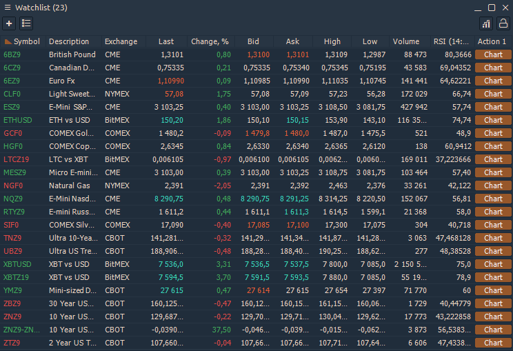
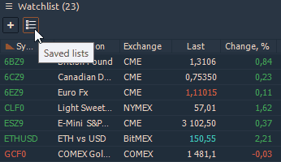
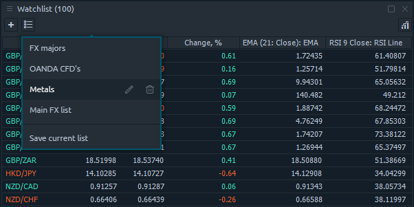
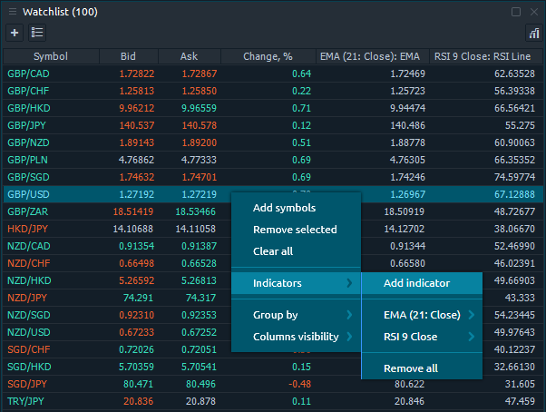
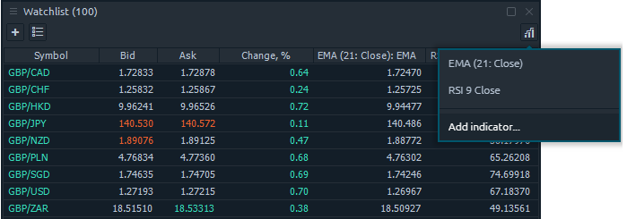

# Watchlist

The Watchlist panel is the standard table-based panel, representing a various trading info for the specified list of symbols. The list of symbols can be customized using the symbol lookup screen, available by pressing **\[ + \]** button on the toolbar, or from table context menu — “_**Add symbols**_“ option.

Each symbol added to watchlist can be removed via the context menu on the symbol’s row. You can also clear all list via the context menu.


When you add a symbol, that is already presented in current list, it will be added to the end of the list thus making a duplicates.


### Columns management

### Favorite lists

You may want to have a possibility to save several lists for Watchlist panel. To save some list as Favorite, you can use the **\[ Saved lists \]** button on the toolbar. If you have no saved lists yet, it will open a **“Save current list”** popup, where you can set the name for the list, that you are saving.

Once you press the **\[ SAVE \]** button, the new list will be added to the Favorites and became available from the _**“Saved lists”**_ drop-down on the toolbar.

Using the _**“Favorite lists”**_ drop-down, you can manage the current saved lists \(edit name, remove\) and initiate the current list save.


Please notice. When you click on any of favorite lists it will be added below the current list. If you want to see the selected list only, you should clear the Watchlist first.


### Indicators

The Watchlist panel supports the indicators value display in separate columns. In order to add some indicator, thare are two ways to to it:

* right-click on watchlist table and proceed to _**"Indicators" -&gt; "Add indicator"**_ option. This opens an indicators lookup screen, where you should select the required one.

* through the icon _**"Add indicator"**_ in the upper right corner of the Watchlist panel

When you select an indicator, you will see the new column \(with the selected indicator name\) added to the right side of watchlist table. To remove indicator, go to the Indicators category in the context menu and click the _**“Remove Indicator Name”**_ option.


Some indicators need time to calculate their values. You will see the “Initializing...” text in such cells.


If you have created \(or added\) a custom indicator in the platform and want to add it to the Watchlist panel, you need to add an additional parameter to the code. More information about how to do this is given in our guide "[**Adding a custom indicator to Watchlist**](../quantower-algo/custom-indicator-to-watchlist.md)".

