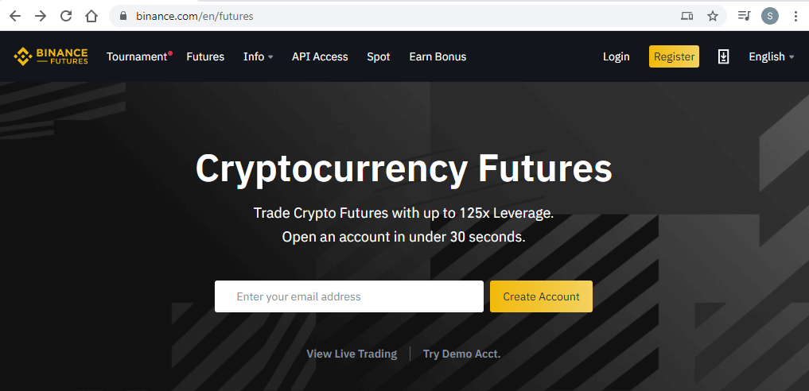
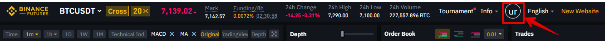
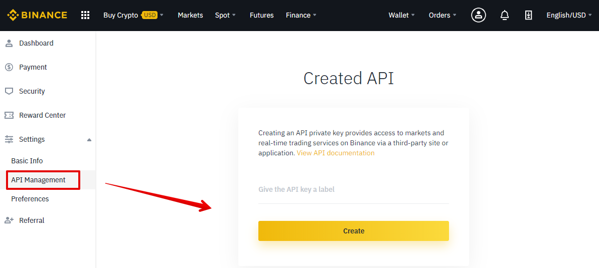
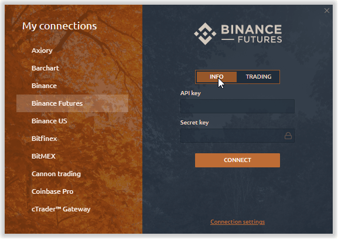
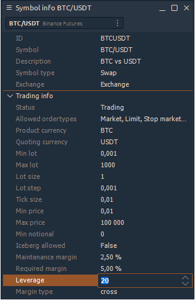
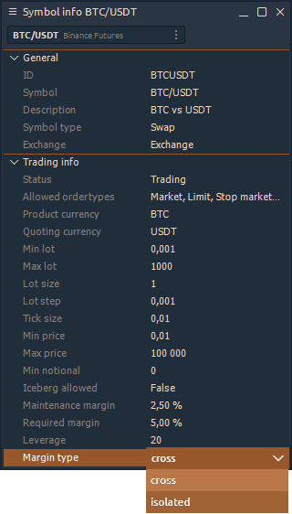
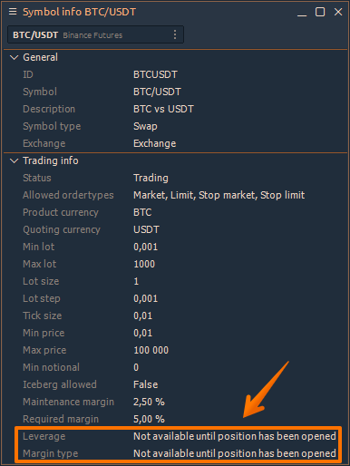

# Connection to Binance Futures

To start trading on Binance Futures through Quantower platform, you need to open an account and create an **API Key** and **Secret Key**. In this guide we will show you step-by-step how to set up the connection, change margin type and leverage size.

* \*\*\*\*[**How to connect to Binance Futures in Quantower platform**](connection-to-binance-futures.md#how-to-connect-to-binance-futures-in-quantower-platform)\*\*\*\*
* \*\*\*\*[**How to change Leverage and Margin Type**](connection-to-binance-futures.md#how-to-change-leverage-and-margin-type)\*\*\*\*
* \*\*\*\*[**How to get Full License of Quantower for free with Binance?**](connection-to-binance-futures.md#how-to-get-full-license-of-quantower-for-free-with-binance)\*\*\*\*
* \*\*\*\*[**Possible Errors with Binance Futures connection**](connection-to-binance-futures.md#possible-errors-with-binance-futures-connection)\*\*\*\*

## How to create a new Binance Futures account

* Go to the ****[**Binance Futures**](https://www.binance.com/en/futures) official website to open a _**live account**_.  If you want to create a _**demo account**_, you can open it on [**Testnet Binance Futures**](https://testnet.binancefuture.com/en/futures) website

* Fill in the account registration form with your email and safe password. Click on Create account and you will receive a verification email shortly. Follow the instructions in the email to complete your registration.
* Once you are on the Binance Futures page, you should be able to see the first two characters of your email address associated with your account in the top right corner.

* Click on the logo of your account and in the _**Settings**_ section select _**API Management**_. Create a new API Key \(if you don't have it\) and save it.

Once you will create an API key, please click on the **Wallet** menu and select **Futures** section. After confirming the opening of a futures account, an additional option will appear for your key, which is called **Enable Futures**.

Please activate it and after you can connect to Binance Futures in Quantower

## How to connect to Binance Futures in Quantower platform

* Launch Quantower platform and open [Connections Manager](connections-manager.md). Select Binance Futures in the list and select the type of connections — **INFO** or **TRADING** mode.

* For trading, please enter your **API Key** and **Secret Key**.

## How to change Leverage and Margin Type

* Binance Futures allows you to trade various instruments and manually change the leverage for each one. To change it, open the [**Symbol Info**](../informational-panels/symbol-info.md) panel and select the necessary symbol. At the bottom of this panel there is a **Leverage** field where you can change the value and apply it by clicking the **Enter** button.

Binance offers two types of margin for futures trading:

**Cross Margin Mode**: Share your margin balance across all open positions to avoid liquidation. In the event of liquidation you risk losing your full margin balance along with any remaining open positions. 

**Isolated Margin Mode**: Manage your risk on individual positions by restricting the amount of margin allocated to each. If the margin ratio of a position reached 100%, the position will be liquidated. Margin can be added or removed to positions using this mode.


For new accounts on which no trades were made, it is **not possible to change the leverage and margin type**. 

To enable these functions, you need to make at least 1 trade for current symbol. After that, please restart the platform and these features will be available.


## How to get Full License of Quantower for free with Binance?

First, you need to register a new account on Binance exchange, that wouldn’t be connected with any referral previously. In order to do this, please follow the [https://accounts.binance.com/en/register](https://accounts.binance.com/en/register) link and fill in the registration form.


Please note! The Referral ID field must be empty. If you see any prefilled ID in this field you should CLEAR YOUR **REFERRAL ID** COOKIES in the browser before registration.


### Clearing Referral ID cookies

To clear your saved cookies in the Chrome browser, you should proceed to the “Site information block” and follow the “Cookies section”

Now select each group of cookies and press the “Remove” button. When there will be no cookies in the list, please, press the “Done” button. Now you should refresh your registration page and make sure that the “Referral ID” field is empty. 

When you’ve created a new account with the Binance exchange you may log in using your new credentials via the Quantower terminal and start using all of its premium features for free.

## Possible Errors with Binance Futures connection

**"Invalid API Key"** error occurs for several reasons:

* a trader **did not enable Future Trading** in the personal account on the Binance website
* API Keys were not copied correctly.


If you sure that everything is correct, please recreate the new keys and the problem is resolved. It's better to recreate it through another browser \(sometimes errors occur when creating through Google Chrome\).


To solve it, please check that your API Key has permissions for Futures trading. **Go to Binance official website &gt; Under your account select API management &gt; check & activate Futures Trading**

**"TimeStamp"** error occurs when the time on the Binance server does not match the time on the user's computer.

To solve it, please, go to **Windows Settings &gt; Time & Language &gt;** and click on **Sync Now** button**.**

