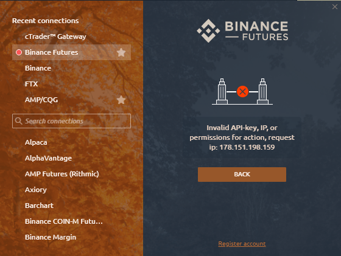

# Errors with Binance connection

Here is the list of the most common errors and issues with Binance Futures /Spot connections:

* \*\*\*\*[**Error "Invalid API-key, IP, or permissions for action"**](errors-with-binance-connection.md#error-invalid-api-key-ip-or-permissions-for-action)\*\*\*\*
* \*\*\*\*[**Error "API-key format invalid"**](errors-with-binance-connection.md#error-api-key-format-invalid)\*\*\*\*
* \*\*\*\*[**Error "Timestamp for this request was 1000ms ahead of the server's time"**](errors-with-binance-connection.md#error-timestamp-for-this-request-was-1000ms-ahead-of-the-servers-time)\*\*\*\*
* \*\*\*\*[**Error "Timestamp for this request is outside of the recvWindow"**](errors-with-binance-connection.md#error-timestamp-for-this-request-is-outside-of-the-recvwindow)\*\*\*\*
*  ****

  \*\*\*\*[**Error "Order's notional must be no smaller than 5.0 \(unless you choose to reduce only\)**](errors-with-binance-connection.md#error-orders-notional-must-be-no-smaller-than-5-0-unless-you-choose-to-reduce-only)\*\*\*\*

* \*\*\*\*[**Error "Margin is insufficient"**](errors-with-binance-connection.md#error-margin-is-insufficient)\*\*\*\*
* \*\*\*\*[**Error "Too many new orders"**](errors-with-binance-connection.md#error-too-many-new-orders)\*\*\*\*
* \*\*\*\*[**Error "Balance is insufficient"**](errors-with-binance-connection.md#error-balance-is-insufficient)\*\*\*\*
* \*\*\*\*[**Error "This listenKey does not exist"**](errors-with-binance-connection.md#error-this-listenkey-does-not-exist)\*\*\*\*
* \*\*\*\*[**Error "Too much requests weight used; current limit is 1200 request weight per 1 minute. Please use the websocket for live updates to avoid polling the API"**](errors-with-binance-connection.md#error-too-much-requests-weight-used-current-limit-is-1200-request-weight-per-1-minute-please-use-the-websocket-for-live-updates-to-avoid-polling-the-api)\*\*\*\*
* \*\*\*\*[**Error "Parameter 'start time' is invalid"**](errors-with-binance-connection.md#error-parameter-start-time-is-invalid)\*\*\*\*
* \*\*\*\*[**Error "Signature for this request is not valid"**](errors-with-binance-connection.md#error-signature-for-this-request-is-not-valid)\*\*\*\*

### **Error "Invalid API-key, IP, or permissions for action"**

**"Invalid API Key"** error occurs for several reasons:

* a trader **did not enable Future Trading** in the personal account on the Binance website
* API Keys were not copied correctly.


If you sure that everything is correct, please recreate the new keys and the problem is resolved. It's better to recreate it through another browser \(sometimes errors occur when creating through Google Chrome\).


To solve it, please check that your API Key has permissions for Futures trading. **Go to Binance official website &gt; Under your account select API management &gt; check & activate Futures Trading**

### Error "API key format invalid"

Check that your **API Key** and **API Secret** are correct.

### Error "Timestamp for this request was 1000ms ahead of the server's time"

**"TimeStamp"** error occurs when the time on the Binance server does not match the time on the user's computer.

To solve it, please, go to **Windows Settings &gt; Time & Language &gt;** and click on **Sync Now** button**.**

### Error "Timestamp for this request is outside of the recvWindow"

The platform synchronizes time with the Binance exchange during the connection. If the desynchronization reaches a certain limit, then any \(authorized\) requests will display this error.

To solve it, please, go to **Windows Settings &gt; Time & Language &gt;** and click on **Sync Now** button**.**

### Error "Order's notional must be no smaller than 5.0 \(unless you choose to reduce only\)

As of February 24, 2021 the value of the perpetual futures order must be at least $5. If it is less than that, the order will be rejected. If you encounter this error, increase the volume you are placing so that it is greater than or equal to $5.

Example: When opening 0.001 ETH, the value of the order is greater than $5, so it will be placed. An order for 1 ANK is worth less than $5, so it will be rejected.

### Error "Margin is insufficient"

This error occurs when trying to place the order. Please check your wallet balance and make sure that there is enough coin to make a trade. When trading USDS-M futures on Binance Futures, the wallet account must have USDT tokens.

### Error "Too many new orders"

Limit on the number of orders has been reached \(usually this is a limit on a particular instrument\). There may be a limit on the instrument itself, or a limit on orders sent in a certain period \(for example, 10 orders per second - spam\).

### Error "Balance is insufficient"

This error occurs when **you don't have enough funds on the balance**. Check your wallet balance and make sure you have enough coins for the transaction.

### Error "This listenKey does not exist"

This error occurs when a trader connects to Binance exchange with the same API Key on various platforms. Each platform must have its own API Key. **Generate a new API key for Quantower platform**.

### An error has occurred: "I can't close the position. Request was executed partially - the value of the open position is less than $5. 

This situation is connected with the rule of exchange Binance Futures about the minimum order volume from $5. You may close a position worth less than $5 using the following methods:

1. Buy up to minimum volume and place limit order to close position. 

2. Place a pending stop order to close the position with a volume equal to the position. 

3. Set Stop-Loss or Take-Profit on the server-side.

4. Close the order through Binance Futures website.

### Error "Too much requests weight used; current limit is 1200 request weight per 1 minute. Please use the websocket for live updates to avoid polling the API"

Binance has set a limit of requests for a certain time \(e.g., sending an order, requesting an instrument table\). If the limit is exceeded, an appropriate message may appear, or the IP will be banned for making requests for some time.

### **Error "Parameter 'start time' is invalid"**

This error does not affect the correct data loading or trading. The message appears when switching to a symbol that has not yet been loaded in the current active session.

### Error "Signature for this request is not valid"

Usually, the error indicates that the keys are not entered correctly. It is likely that the API Key/Secret key is entered correctly, but maybe "broken". **Check if the APIKey and APISecret are entered correctly or recreate the keys.**

