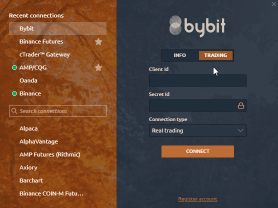
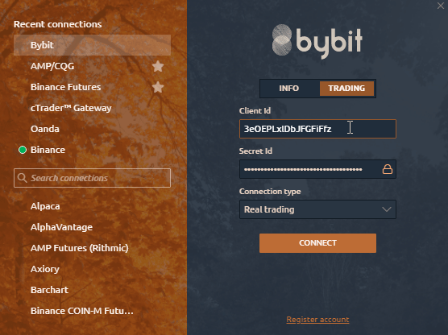

# Connection to Bybit

In this guide, we will cover all the steps required to create a trading account on Bybit and connect to the Quantower platform.

* \*\*\*\*[**Open an account on Bybit to get personal API keys**](connection-to-bybit.md#open-an-account-on-bybit-to-get-personal-api-keys)\*\*\*\*
* \*\*\*\*[**Possible Errors with Bybit connection**](connection-to-bybit.md#possible-errors-with-bybit-connection)\*\*\*\*

Note, that in the platform, you can connect to the exchange in two modes:

* **Info Mode** — free and quick way to view charts and other data for cryptocurrencies on the Bybit exchange without the need to enter keys
* **Trading Mode** — for trading on the Bybit exchange in demo or real mode. API Keys are required. Below you will show how to get keys for trading.

### Open an account on Bybit to get personal API keys


For **REAL Trading** please create an account on Bybit.com [https://www.bybit.com/en-US/invite/?ref=n9X0D](https://www.bybit.com/en-US/invite/?ref=n9X0D)

For **DEMO Trading** please create an account on Testnet.Bybit.com [https://testnet.bybit.com/](https://testnet.bybit.com/)


Go to the [**Bybit official website** using this link](https://www.bybit.com/en-US/invite?ref=n9X0D) and go through the procedure for registering a new account on the exchange.

For email registration, please enter your email, preferred password and \(!\) referral code **n9X0D**   
Swipe the verification page then enter the verification code sent to your email inbox.

To create/manage your Bybit API keys, please click onto the top right on your username. Inside the dropdown menu, click on **'API'.**

Click on **'Create New Key'** located on the right side of the **'API Management'** page


 **You need to configure two-factor authorization on Bybit. It is necessary for creating keys.**


The following pop-out window will appear. Please configure your API key according to your trading needs. Enter your Google Authenticator 2FA and click on 'Confirm' to proceed

Enter your API information, such as a reference name for your API key under **'Name'** and select **'Active Order and Positions'** in the section **'Key Permission',** and proceed to enter your Google authenticator 2FA code before you click on “Confirm”

Once you receive the keys, save them. After closing the window, you will not be able to see the "APIPrivate Key" again.

Use your personal API Keys to login into your trading account in Quantower platform.

### Possible Errors with Bybit connection

**"Timestamp error"** means that your local time on PC is not the same as on Bybit servers and it should be synchronized.

To solve it, please, go to **Windows Settings &gt; Time & Language &gt;** and click on **Sync Now** button**.**

