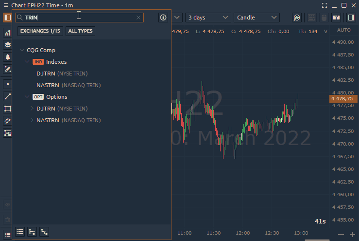

# Connection to CQG (AMP Futures)

* [**How to Create a New Demo Account?**](./#how-to-start-trading-via-amp-cqg-connection)
* [**How to Find a Trading Symbol in Quantower for CQG connection?**](./#how-to-add-trading-symbols-from-the-cqg-connection)
* [**How to add TRIN, TICK market indicators into Quantower?**](./#how-to-add-trin-tick-market-indicators-into-quantower)
* [**Possible Errors with CQG connection**](errors-with-cqg.md)
* [**Trading with AMP/CQG (key points) — OCO, Brackets, Multi-Brackets**](../../trading-panels/order-entry/order-entry-for-cqg.md)
* [**How to set custom trading sessions for futures on CQG, Rithmic?**](./#how-to-set-custom-trading-sessions-for-futures-on-cqg-rithmic)
* [**How to enable continuous futures on CQG?**](./#how-to-enable-continuous-futures-on-cqg)

CQG provides access to more than [75 world exchanges](https://www.cqg.com/partners/exchanges), allowing you to trade futures, options, stocks, bonds, commodity spreads, and much more.\
Besides, traders get the opportunity to work with a wide range of analytical tools, like [volume profiles](../../analytics-panels/chart/volume-analysis-tools/volume-profiles.md), [footprint (cluster chart)](../../analytics-panels/chart/volume-analysis-tools/cluster-chart.md), [VWAP](../../analytics-panels/chart/vwap.md), [Power Trades](../../analytics-panels/chart/power-trades.md), [TPO chart](../../analytics-panels/tpo-chart.md), [DOM Trader](../../trading-panels/dom-trader/), [Option Analytics](../../analytics-panels/option-analytics.md) and [DOM Surface](../../analytics-panels/dom-surface.md) panels.

### How to start trading via AMP/CQG connection?

Below there is the link where you can register a **demo account for 28 days** and try all the functionality of the platform at work. If you already have a live trading account, you can start your trading directly via Quantower.



Fill out the form on the AMP website and within several minutes you will get an email from CQG with your credentials (Login and Password).

.png>)

### How to find trading symbols for the CQG connection?

By default, we do not provide a predefined list of symbols (maybe in the next updates we will add default symbols). To find the desired symbol, go to the [**Tradable Symbols**](https://www.cqg.com/partners/exchanges/tradable-symbols) page on the CQG site where you can find a correct ticker. Also, we’ve prepared a list of the most frequent trading symbols for the futures market.

| **CME Globex**                        | Ticker | 
Available 

for demo
 |
| ------------------------------------- | ------ | -------------------------------- |
| E-mini S\&P 500 Futures               | EP     | ✔                                |
| Micro E-mini S\&P 500 Index Futures   | MES    | ✔                                |
| E-mini Nasdaq-100 Futures             | ENQ    | ✔                                |
| Micro E-mini Nasdaq-100 Index Futures | MNQ    | ✔                                |
| E-mini Russell 2000 Index Futures     | RTY    | ✔                                |
| Euro FX Futures                       | EU6    | ✔                                |
| Micro EUR/USD Futures                 | M6E    | ✔                                |
| British Pound Futures                 | BP6    | ✔                                |
| Australian Dollar Futures             | DA6    | ✔                                |
| Canadian Dollar Futures               | CA6    | ✔                                |
| Japanese Yen Futures                  | JY6    | ✔                                |
| New Zealand Dollar Futures            | NE6    |                                  |
| Swiss Franc Futures                   | SF6    | ✔                                |
| **CBOT**                              |        |                                  |
| E-mini Dow ($5) Futures               | YM     | ✔                                |
| Micro E-mini Dow Jones Futures        | MYM    | ✔                                |
| U.S. Treasury Bond Futures            | USA    | ✔                                |
| 2-Year T-Note Futures                 | TUA    |                                  |
| 5-Year T-Note Futures                 | FVA    |                                  |
| 10-Year T-Note Futures                | TYA    | ✔                                |
| Soybean Futures                       | ZSE    | ✔                                |
| Wheat Futures                         | ZWA    | ✔                                |
| Corn Futures                          | ZCE    | ✔                                |
| **NYMEX**                             |        |                                  |
| Crude Oil Futures                     | CLE    | ✔                                |
| E-mini Crude Oil                      | NQM    | ✔                                |
| Natural Gas Futures                   | NGE    | ✔                                |
| Heating Oil                           | HOE    |                                  |
| **COMEX**                             |        |                                  |
| Gold Futures                          | GCE    | ✔                                |
| Micro Gold Futures                    | MGC    |                                  |
| Silver Futures                        | SIE    | ✔                                |
| Copper Futures                        | CPE    |                                  |

### How to add TRIN, TICK market indicators into Quantower?

CQG provides access to [market indicators via AMP Futures](https://www.ampfutures.com/trading-info/cqg-supported-indexes) that allow you to assess the overall sentiment of the market. **TRIN** and **TICK** are the most popular indicators that can be used to determine the short-term price movement.

**TRIN** shows the ratio between the number of advancing and declining stocks (AD Ratio) to advancing and declining volume (AD volume).

**TICK** shows the difference between the number of stocks trading on upticks and downticks. It uses as an intraday indicator.

#### To get access to these indicators:

* a [**subscription**](https://www.ampfutures.com/trading-info/exchange-data-fees) to this data is required (contact your broker to activate)
* if you already have a subscription, open the connection settings and activate the **CQG Comp** exchange to download these symbols

 (1) (1).png>)

* Connect to CQG and start typing the name of the required indicator in the symbol search field

 (1).png>)

### **How to set custom trading sessions for futures on CQG, Rithmic?**

Due to the fact that data providers do not provide information about trading sessions for trading assets, traders may face the problem of incorrect display of [volume analysis data](../../analytics-panels/chart/volume-analysis-tools/) for **Regular trading hours (RTH)** and for **Electronic trading hours (ETH)**. To solve this problem, a trader can set up the necessary sessions for an individual instrument, exchange, or the entire connection to the provider.

As an example, let's set the time of RTH and ETH sessions for CME Indexes:

* Open [<mark style="background-color:blue;">**Sessions Manager**</mark>](../../miscellaneous-panels/sessions-manager.md) panel in the Misc section

 (1) (1).png>)

* Click the <mark style="background-color:blue;">**Sessions templates**</mark> button on the toolbar and <mark style="background-color:blue;">**Create new**</mark> to open the Session template creation screen.

 (1).png>)

* Set up a new template's parameters, such as: **Template's name, Timezone, Session's name, Time** and **Days.** Once you finish setting the sessions template, click the <mark style="background-color:blue;">**Save**</mark> button.


Trading hours for RTH / ETH sessions of CME Indexes (ES, NQ, RTY etc.) you can find on [CME Group website](https://www.cmegroup.com/markets/equities/sp/e-mini-sandp500.contractSpecs.html).




<figure><figcaption>
Custom trading session for CME Indexes for Regular trading Hours (Central Time)
</figcaption></figure>



<figure><figcaption>
Custom trading session for CME Indexes for Electronic trading Hours (Central Time)
</figcaption></figure>



<figure><figcaption>
Custom trading session for CME Indexes for the full trading day )ETH+RTH) (Central Time)
</figcaption></figure>



* To assign previously created templates to some symbol, you need to call the Sessions assignment screen by clicking the <mark style="background-color:blue;">**Assign sessions**</mark> button on the toolbar.

 (1).png>)

* Apply or switch between different sessions on desired panels (chart, DOM trader, TPO etc.). Just open the panel's settings and find the <mark style="background-color:blue;">**Custom session**</mark> parameter (usually in the General section).

.png>)

### **How to enable continuous futures on CQG?**

CQG provides access to continuous futures data ONLY for LIVE ACCOUNTS. To activate this data, go to the connection settings and turn on "**Request continuation history**".


Note that CQG has data limitations for continuous futures:

* 3-month history limit for intraday bars
* 3-year history limit for daily bars


<figure><figcaption></figcaption></figure>
