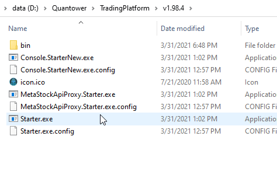

# Errors with CQG

Here is the list of the most common errors and issues with CQG connection:

* \*\*\*\*[**Error "Index was outside the bounds of the array"**](errors-with-cqg.md#error-index-was-outside-the-bounds-of-the-array)\*\*\*\*
* \*\*\*\*[**Error "This account is only allowed to liquidate open positions"**](errors-with-cqg.md#error-this-account-is-only-allowed-to-liquidate-open-positions)\*\*\*\*
* \*\*\*\*[**Chart Data is incorrect or has gaps**](errors-with-cqg.md#chart-data-is-incorrect-or-has-gaps)\*\*\*\*
*  ****

  \*\*\*\*[**Can not find a symbol**](errors-with-cqg.md#can-not-find-a-symbol)\*\*\*\*

* \*\*\*\*[**Error "Refuse: End of Day is not allowed for given data type"**](errors-with-cqg.md#error-end-of-day-is-not-allowed-for-given-data-type)\*\*\*\*
* **Error "Refuse: Can not route the order at this time"**

## Error "Index was outside the bounds of the array"

This error can occur when the Internet connection is weak, or when there is an error during loading the symbol files. _**To solve it, click Back and try to connect again.**_

## Error "This account is only allowed to liquidate open positions"

This error occurs when trading on your account has been **restricted by a Broker or Prop trading company** due to reaching the loss limit or for other reasons. To resolve this issue, please contact your Broker or Prop trading company.

## Chart Data is incorrect or has gaps

Sometimes, non-market gaps can occur due to a weak Internet connection, a broken connection to your data provider, or other reasons. To solve this problem, **Right-click on the chart** and select **Reload history \(server\).**

## Can not find a symbol

* Make sure that you typed the correct ticker \(symbol\) for CQG connection.
* If the symbol is typed correctly, check in the **connection settings** that the required exchange is activated. If the exchange is disabled, you should activate it and then start searching for the desired symbol again.

* If the correct symbol cannot be found even with an active exchange, it is necessary to re-download the list of symbols from the CQG servers. Open the main platform folder and clear the Temp folder where the CQG symbols are stored. Delete the entire CQG folder and reconnect.

## Error "End of Day is not allowed for given data type"

Sometimes this error occurs for new demo accounts. We recommend **contacting AMP support staff** or to support of a prop company \(like SpeedUP trader\).

## Error "Real-time data for instrument XXXX are not allowed"

This error usually occurs for new demo accounts

