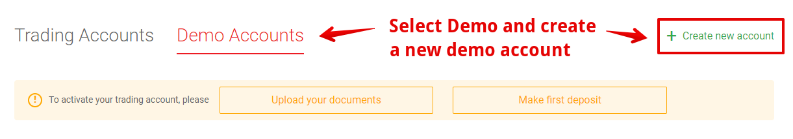
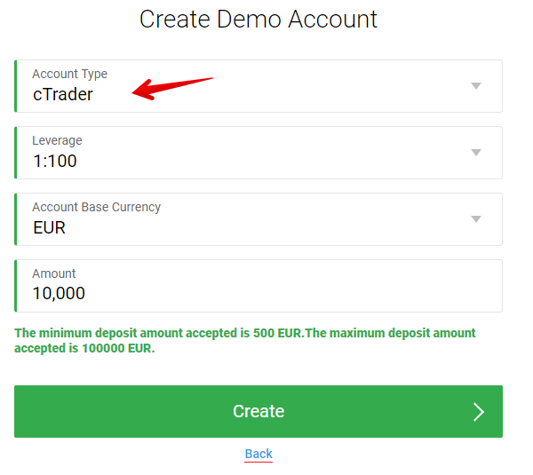
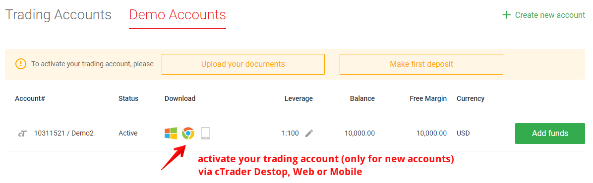
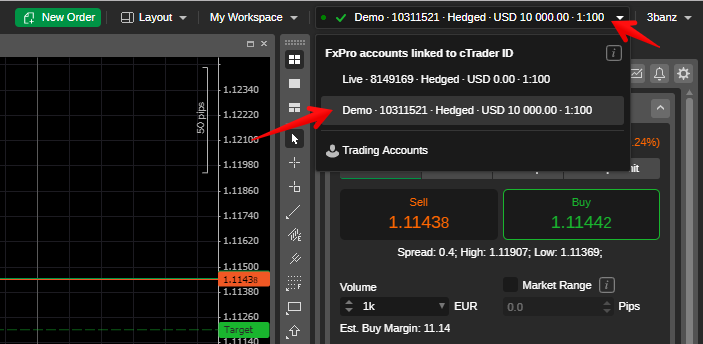
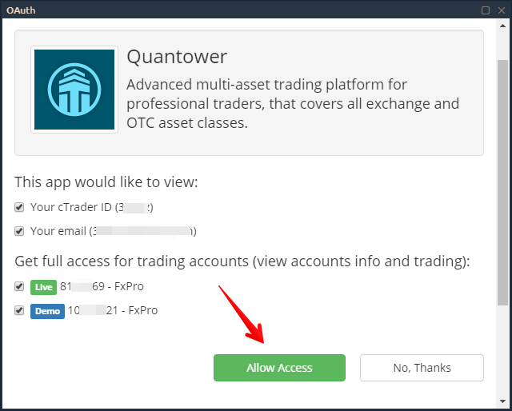

# How to connect to FxPro via Quantower

To connect Quantower platform to FxPro broker and send trading orders, you need to use cTrader Gateway. If you already have a trading account with FxPro, then go to the penultimate step in this manual.



* Go to the official FxPro website, and in the [**Tools** section](https://www.fxpro.com/trading-platforms/ctrader) select the cTrader platform
* **Create a trading account** by filling out the registration form. Demo and Real account are created under one cTrader ID, therefore there is only one form for opening an account. During the registration, always choose the **cTrader** platform where you need to specify it.

* After registration, you need to create a demo account under your cTrader ID

* Choose cTrader platform, leverage, account currency and account size

* After creating a demo account, check the E-Mail that you used when registering your account. In the letter with subject **"Welcome to cTrader ID"** is your ID that will be used as a login in platforms Quantower and cTrader. Set the password for authorization by clicking on the **"Set Password"** button.


To enter the Quantower platform, use the **cTrader ID** and **password** that you set in the previous step.


* Before connecting for the first time through Quantower platform, you need to activate your account in the cTrader system. You can do it via FxPro **cTrader Web-based** platform [https://ct.fxpro.com/](https://ct.fxpro.com/)

* Once you logged in to the cTrader web terminal, accept the agreement and switch to the demo account in the upper right corner of the web terminal. This is necessary to activate both the Real and Demo accounts separately.

* After that, in the Quantower platform in the connection manager, select cTrader Gateway connection with Demo or Real and press **"Connect"** button. An authorization form will appear, where you need to specify an email or cTrader ID, as well as a password. This is a standard OAUTH authorization where you can see the connection information. **Allow access** and start trading :\)

* You can place orders via Quantower or cTrader. Good luck!

  

