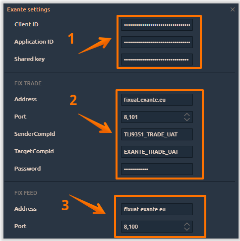
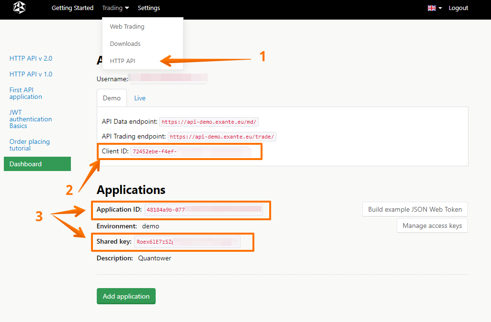
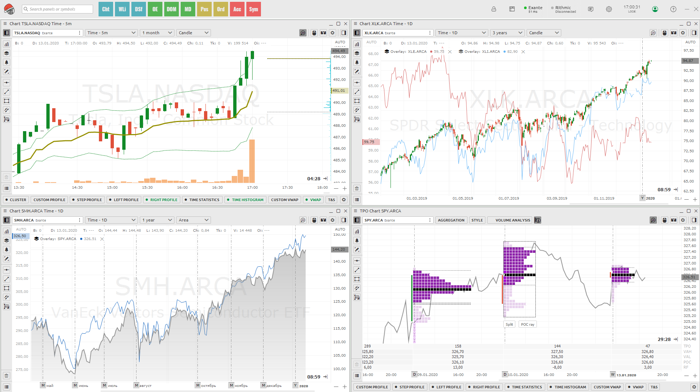

# Connection to Exante

In order to trade via Quantower platform with Exante broker, you need to have a live trading account.

* Open the connection manager in Quantower platform and select Exante connection in the list. Click on the **Connection Settings**.

To get credentials for the **section 1** like **Client ID, Application ID, Shared Key**, please follow steps bellow:

* Go to [Exante official website](https://exante.eu/#signin), authorize in their system and enter to personal cabinet.
* In the **Trading** section click on the **HTTP API.**

* Copy your **Client ID** and paste it to Quantower settings.
* Copy **Application ID** and **Shared Key** and paste them to Quantower settings. If you do not have these data, click **Add application** and after you receive it.

To get credentials for the **section 2 and 3**, please contact to Exante's support team and they will provide all necessary parameters. Enter data carefully, without extra spaces and punctuation, especially the address and port \(see screenshot above\).

* Enter the data for **FIX TRADE** and **FIX FEED** sections that are provided by the broker via their support.
* Once you have entered all the access parameters, you can trade through the Quantower platform.

