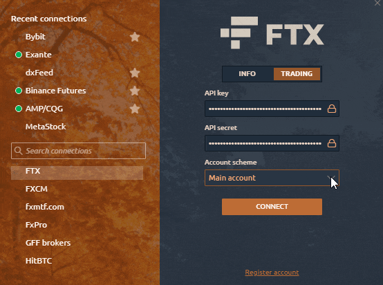

# Connection to FTX

In order to use Quantower features from the All-in-one package for free, you just need to connect to FTX exchange with your account \(API Key\). If you don’t have an account, please [**open it with a commission discount for 5%**](https://ftx.com/#a=quantower) by using the referral link. All our paid features like volume analysis, power trades, option analytics, advanced features, DOM surface or TPO profile chart are already available for all FTX symbols at zero cost.



Added the ability to select the main and sub-accounts. Due to the specifics of the exchange API, the speed of order processing was executed with a delay of up to 5 seconds, which led to a slippage of the order and incorrect opening of orders. For example, if you work only on the Main account, the processing of orders is much faster than when you connect to multiple accounts \(Main + Sub-accounts\).

