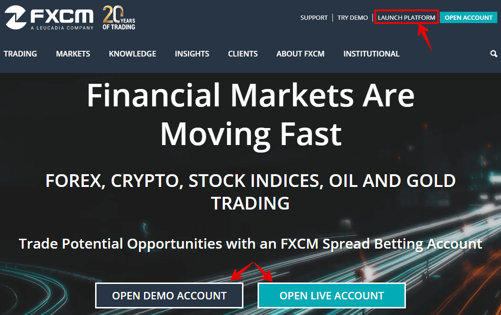
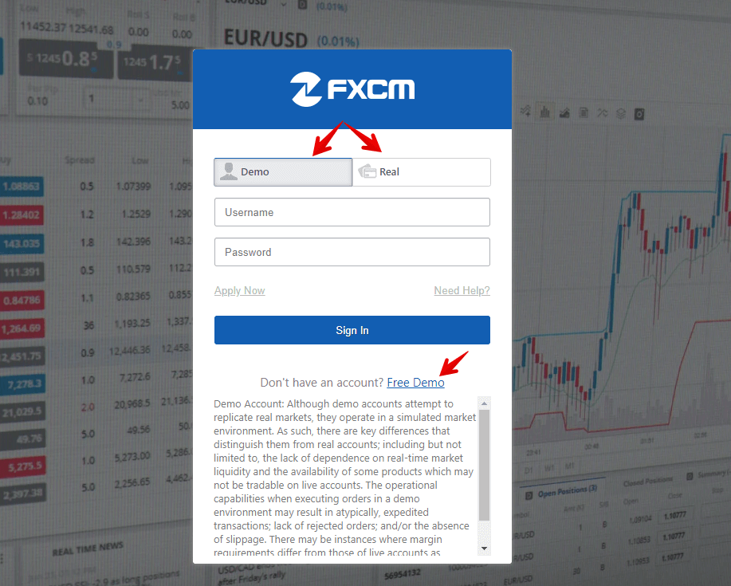
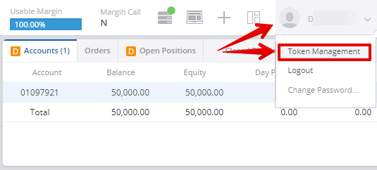
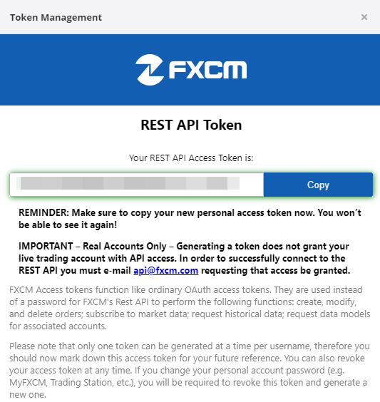
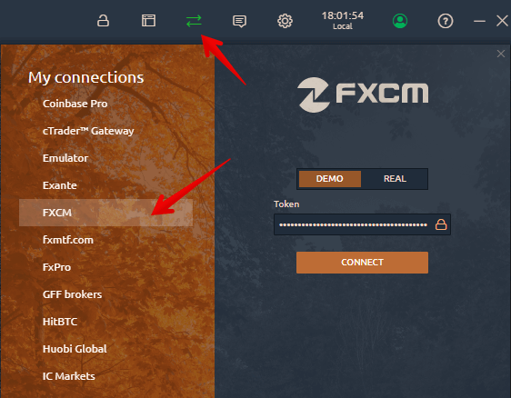

# Connection to FXCM

To connect Quantower to FXCM broker, you need to activate unique Token API. Below we have described the step-by-step process of getting a token.



* Go to the [**FXCM** official website](https://www.fxcm.com/) to open a demo or live account. If you already have an account, please log in to the system.
* Click on _**Launch Platform**_  button to create a demo account or click on the link [Forex Trading Demo](https://www.fxcm.com/uk/forex-trading-demo/).

* Fill in the form and press **Submit**. Save the received data — Login and password — and click **Login** to launch the _Trading Station_ web platform.

* In the upper right corner you will see your account number **DXXXXXXXXXXX**. Click on it and select **Token Management**. Enter your previously saved password to get a unique token. Make sure to copy personal access token now. You won't be able to see it again!

* Open **Connection Manager** in Quantower and select FXCM broker. Choose Demo or Real, paste Token key and click Connect button.

