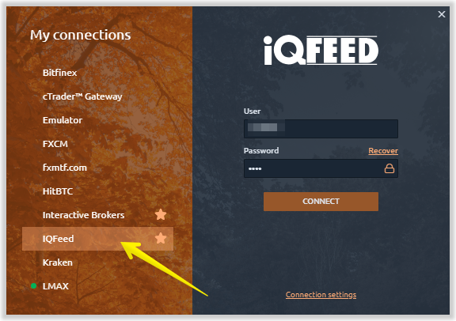
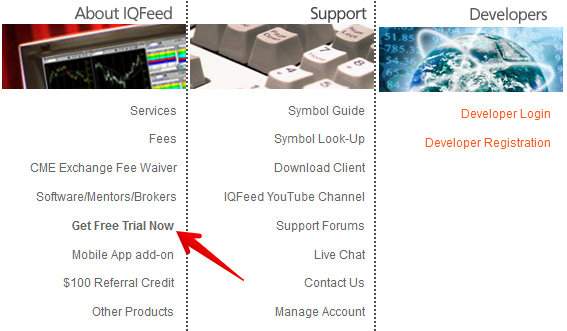
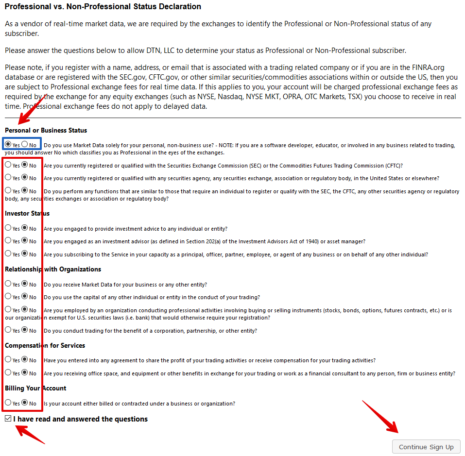
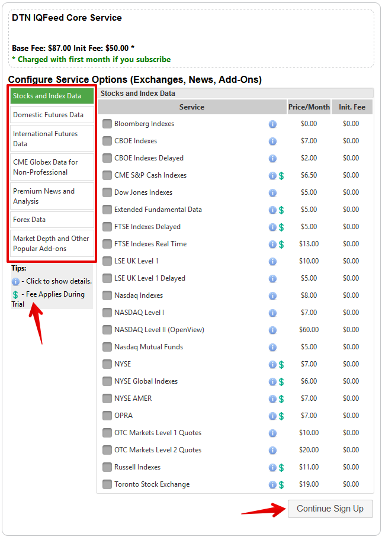
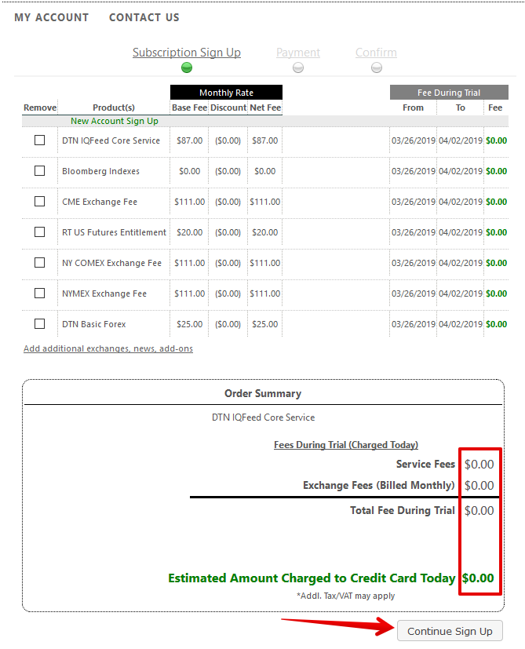
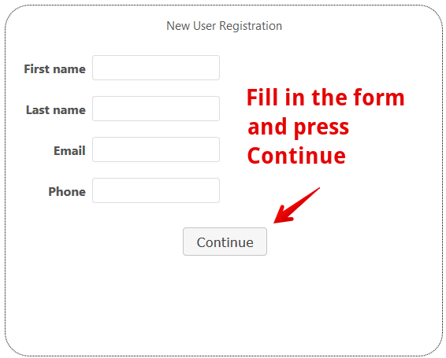
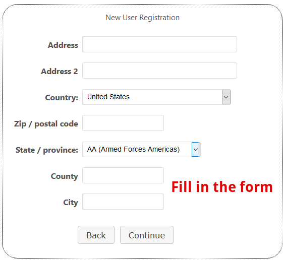
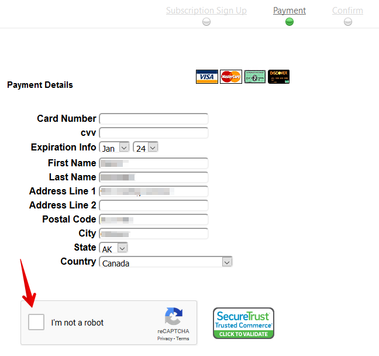
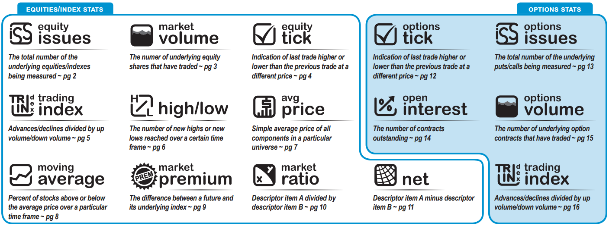
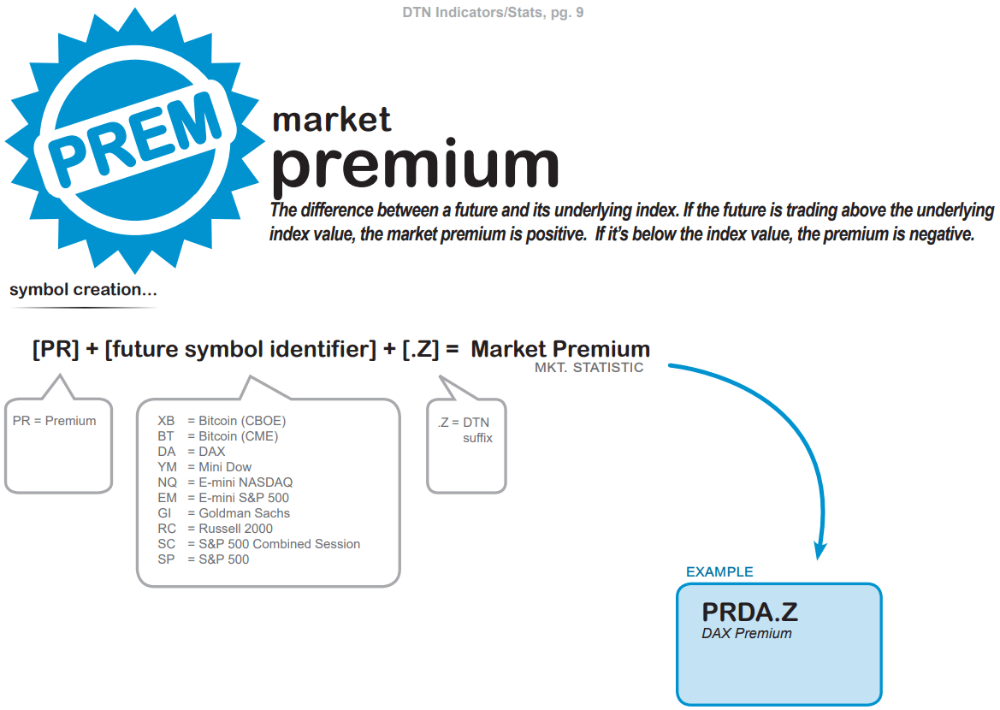

# Connection to IQFeed

You can benefit from market data provided by IQFeed while trading on Quantower platform. All you need to create IQFeed account and to connect it to Quantower. Having registered with IQFeed, a Free Trial Demo Account is automatically opened and you can use it during the determined trial time period for free. After the trial period expires, you will be offered to proceed with real account.

* \*\*\*\*[**How to register and open demo account with IQFeed?**](connection-to-iqfeed.md#how-to-register-and-open-demo-account-with-iqfeed)\*\*\*\*
* \*\*\*\*[**DTN Calculated Indicators & Market Statistics**](connection-to-iqfeed.md#dtn-calculated-indicators-and-market-statistics)  **\(**[**link to document**](http://www.iqfeed.net/symbolguide/DTNCalculatedIndicators.pdf)**\)**

### How to connect IQFeed to Quantower

* Create a [**demo account**](https://www.iqfeed.net/index.cfm?displayaction=start) on the IQFeed official website. If you already have an account, skip this step.
* Download and install the latest version of [**IQFeed client**](http://www.iqfeed.net/index.cfm?displayaction=support&section=download) on your PC.
* Launch Quantower trading platform, select the IQFeed connection in the [**connection manager**](connections-manager.md) and enter your **Login** and **Password of IQFeed** account. Press Connect and you will see that IQFeed client start automatically.

### How to register and open demo account with IQFeed?

It may seem some confused issue for newbies to open demo account with IQFeed data provider. Nevertheless it becomes considerably easier when doing that with the usage of our instructions!

* Go to [IQFeed official website](https://www.iqfeed.net) and follow  ‘[**Get Free Trial Now**](https://www.iqfeed.net/index.cfm?displayaction=start)’ link in the **About IQFeed** section. In the opened window select the first offered option \(DTN IQFeed\) and click on the **Continue to DTN Registration Site** button.

* Once you click **Continue to DTN Registration Site** button, the following window will apper in which you need to tick off the items as it is shown on the picture below, place a check mark in the **I have read and answered the questions** case and **Continue Sign Up**:

* Select your country and proceed.

* Select the data you are willing to be provided with by IQFeed.


Only data with NO dollar sign \(as it is indicated in the left side of the screen\) is free of charge during the trial period. If you are willing to use free trial version,select the items without dollar sign. In case you selec the items with dollar sign, the respective payment will be charged from your bank card.


* Check the amount stated in the Fee section of the following window. In case you wish to get IQFeed data completely free during trial period, your total amount to pay should equal $0.00. Check it and **Continue Sign Up**

* In the respective fields of the following opened windows enter your personal information and click **Continue**:

* Now you are a registered user and a window with the amount to be paid for the IQFeed services will appear again. Check the fees:

* A window with bank card credentials to fill in is opened. Enter data of the bank card you will be using for IQFeed services \(in case you have followed all the above mentioned steps, you will be using Free Trial Demo Account by IQFeed and no money will be charged from your card\) and click on the **Add card** button.

* Check your email box: 2 letters from IQFeed must be sent on the email address indicated by you during the registration before:
* Letter with the subject ‘**Welcome to the DTN Account Management Portal**’ contains login and password information;
* Letter with the subject ‘**DTN IQFeed Login Information**’ means that you can already log in IQFeed system.


**After your Free Trial Demo account is expired, you should take off your bank card from the IQFeed account:**

* Follow the link: [https://my.telventdtn.com/storefront/login](https://my.telventdtn.com/storefront/login) ;
* Log in the system;
* Select [Manage Credit Cards](https://my.telventdtn.com/storefront/customer/ManageCreditCards) ;
* Click on the respective Remove button to sign off your credit card.


### DTN Calculated Indicators & Market Statistics

DTN’s Ticker Plant gives traders an edge by calculating thousands of indicators not available elsewhere that provide insight into historical trends and real-time market dynamics. [**How to request these stats in the platform?**](http://www.iqfeed.net/symbolguide/DTNCalculatedIndicators.pdf)\*\*\*\*

