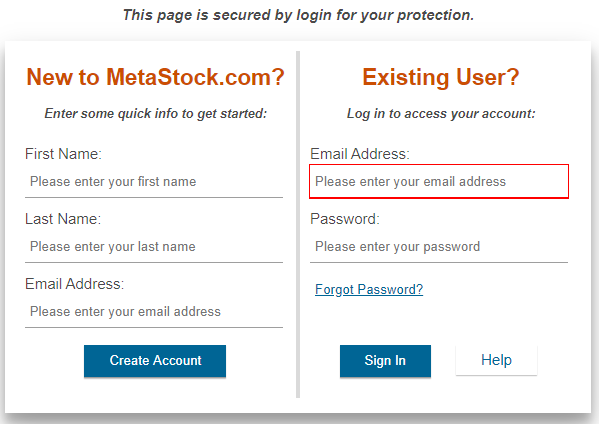
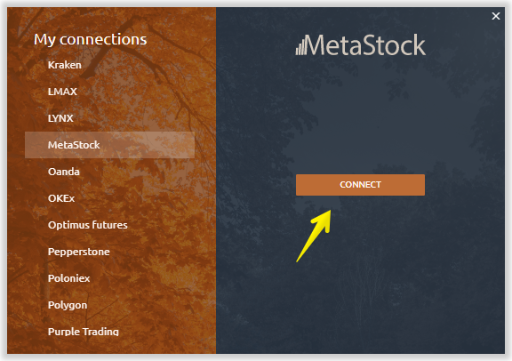
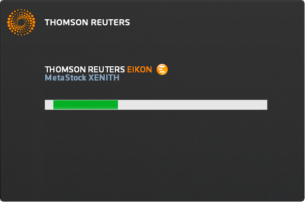

# Connection to MetaStock

* \*\*\*\*[**Download and install Metastock XENITH**](connection-to-metastock.md#download-and-install-metastock-xenith)\*\*\*\*
* \*\*\*\*[**Launch Quantower with Metastock connection**](connection-to-metastock.md#launch-quantower-with-metastock-connection)\*\*\*\*

### How to install Meta**S**tock XENITH / EIKON and create an account?

Metastock provides trial access to its platform for 1 month. [**Follow the link**](https://www.metastock.com/offer/ek/?whc=quantowerek&pc=Eq-quantower) and click on the button “_**Get a FREE 1 month trial of XENITH**_”. Select the market data you'd like to subscribe to.

Metastock offers a database of various analytical data that is divided not only by type, but also by region. For example, if you need market data for a specific exchange, or a region \(Asia, Europe\), you can easily select it on their website. But we recommend using Metastock support for that, which will help you to create the data plan that will fit your requirements.

**Create an account** to get their products. If you already have an account, please login into the system.

### **Download and install Metastock XENITH**

After you have chosen the necessary subscription and created a new account, you need to sign User Agreement, download and install Metastock XENITH. The link is available in your personal cabinet after registration.

### **Launch Quantower with Metastock connection**

Select Metastock connection in the Quantower connection manager and press Connect. That will also launch Metastock software. Enter the credentials you’ve got from Metastock in their application.

