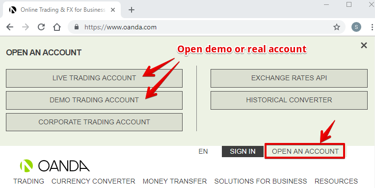
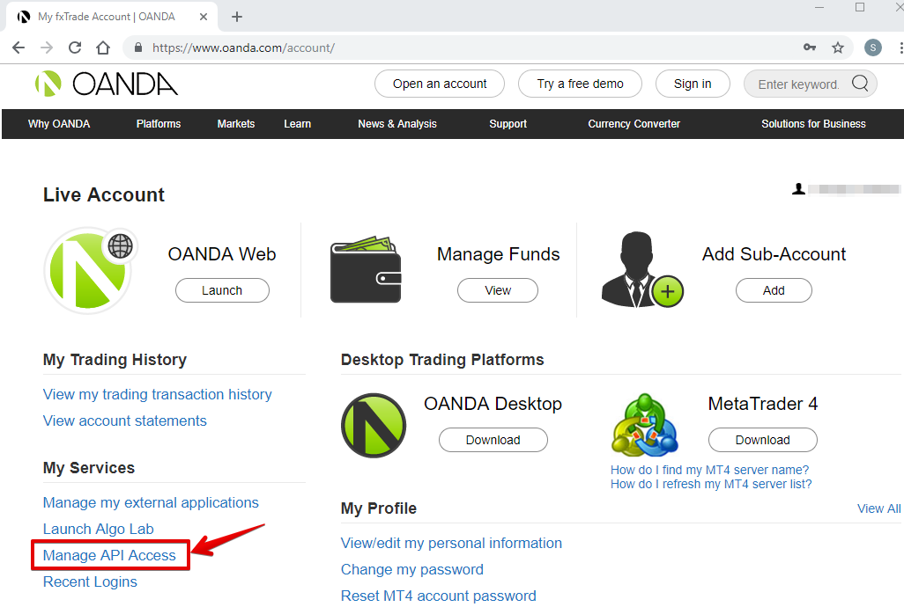
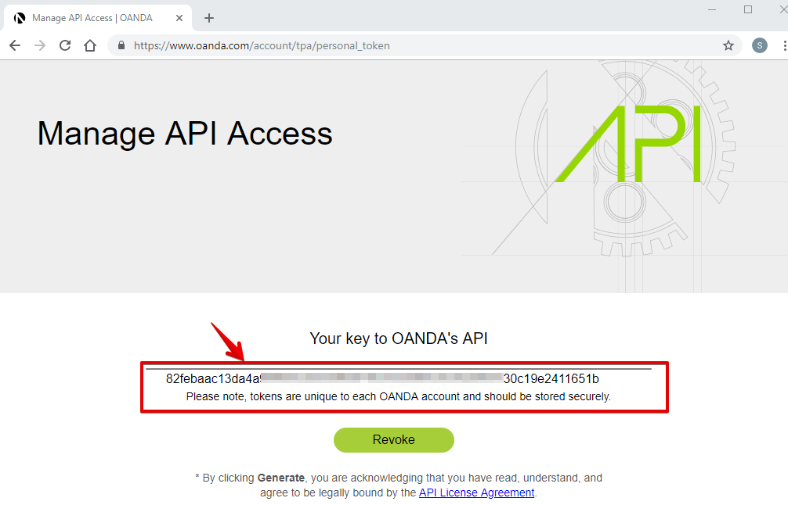
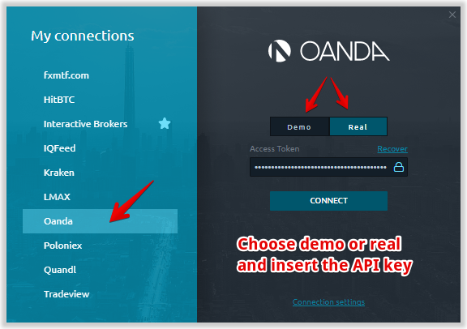
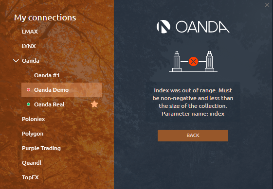

# Connection to OANDA


OANDA doesn't provide tick data for Volume Analysis Data, that's why Volume Profiles or Footprint chart can not be used under this connection.


This guide helps you in a few simple steps to configure the connection to OANDA with the correct settings.

1. Open real or demo trading account with OANDA on their [**official website**](https://www.oanda.com/).

    2. After completing registration and confirming your account, **go to your OANDA account**. To do this, use your _Username_ and _Password_.

    3. Click on **Manage API Access** in _My Services_ to get a unique API key \(Token API\) in your personal cabinet.

    4. **Generate your API key** and copy it carefully. 


In case you have forgotten or lost your API key, you can create a new one at any time. To do this, click the **Revoke** button.


    5. Launch ****[**Quantower platform**](https://www.quantower.com/) ****and select OANDA from the connection list. Choose demo or real connection and insert the API key.

### Issues with connection

Sometimes OANDA cannot authorize users through API Key and you can see the message: _"**Index was out of range. Must be non-negative and less than the size of the collection. Parameter name: index"**_. 

To solve this issue, just click on the **Back** button and try to connect again. In most cases, the API key will be accepted and you will be successfully connected.

