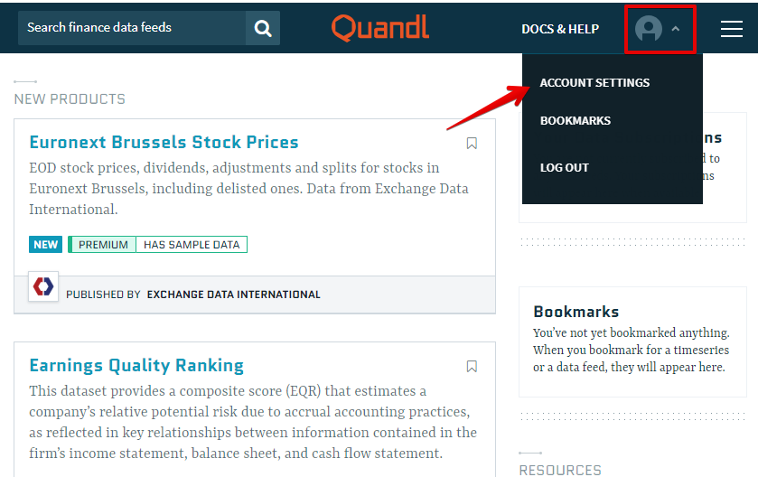
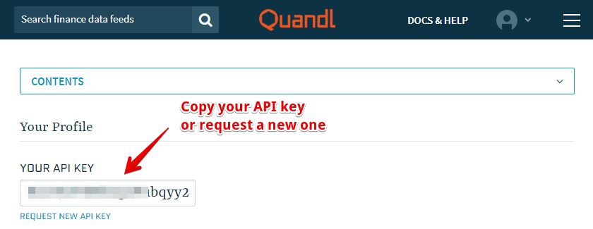
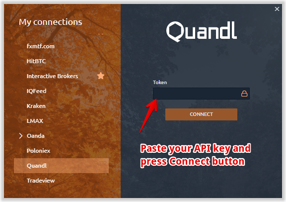

# Connection to Quandl

### **What is Quandl?**

[**Quandl**](https://www.quandl.com/) ****is international financial and economic data provider that offers access to a lot of databases — _stocks, futures, commodities, currencies, interest rates, options, indexes, as well as data on industries, assent management and economics._

The databases cover not only prices on different financial products but a non-price data, such as fundamentals, forecasts, sentiment, traders commitment, production, consumption, employment, inflation, macro indicators, investment and their flows.

As we can see the very extended financial market data is provided and Quandl is worth being connected.

### How to connect Quandl data provider to Quantower?

1. Create an account on the[ **Quandl official website**](https://www.quandl.com/sign-up-modal?defaultModal=showSignUp) by clicking on the **SIGN UP** button on the upper right corner of the page.

After filling the registration form you'll get an email with the confirmation link on your email address indicated in the registration form, please follow the link in order to confirm your registration.

    2. Enter your account on Quandl website, _click on your Profile_ on the right upper corner of the page and follow to the **Account Settings**.

    3. Copy your personal **API key** \(see pic. below\) that is needed for connecting Quandl to Quantower.

    4. When launching Quantower platform, select Quandl connection and enter the API key copied from the Quandl personal cabinet in the **"Token"** field of the Connection manager, then press **CONNECT**.

