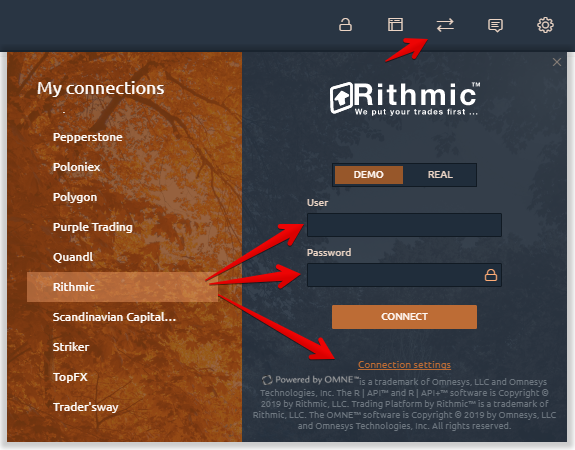
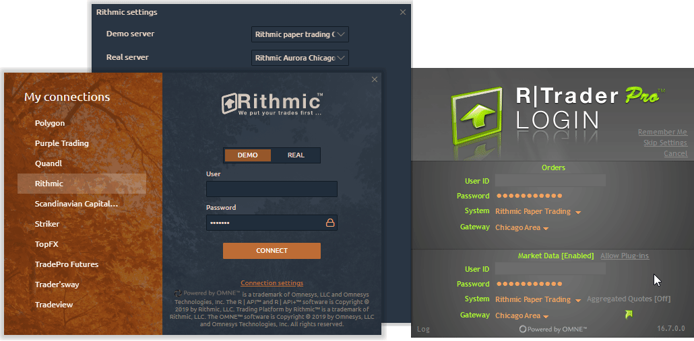

# Connection to Rithmic

To connect Quantower to a broker that uses Rithmic technology, it is sufficient to have \(or create a new\) account.

* \*\*\*\*[**Connection for Existed Accounts**](connection-to-rithmic.md#connection-for-existed-accounts)\*\*\*\*
* \*\*\*\*[**Connection for New Accounts**](connection-to-rithmic.md#connection-for-new-accounts)\*\*\*\*
* \*\*\*\*[**Problems during the connection to Rithmic**](connection-to-rithmic.md#problems-during-the-connection-to-rithmic)\*\*\*\*

### Connection for Existed Accounts

* \*\*\*\*[**Download and install R Trader Pro**](http://yyy3.rithmic.com/?page_id=16) from Rithmic official website.
* Open connection manager, select **Rithmic** and specify the type of connection \(**Demo / Real**\). 
* Click on **Connection Settings** and **activate Use RTrader** option to avoid additonal fees for subscription to market data. If necessary, trader can change the server. By default, the Rithmic Paper Chicago server is set for demo accounts and the Rithmic Aurora Chicago server is set for real accounts.
* Enter your login and password and click **Connect.**


Starting from May 1, the [CME exchange сhanged the rules for determining a professional market participant](http://yyy3.rithmic.com/?p=1069), and as a result, increased the fee for the market data. In order to correctly define the professional participant, Ritmic has changed the connection parameters in their platform, as well as in API for platforms such as Quantower.

To avoid additional fees for subscription to market data, a trader needs to login through the R Trader Pro platform and activate the setting in Quantower, which is called **Use RTrader**.


### Creating a New Accounts and further connection

* \*\*\*\*[**Create a new demo**](https://rithmic.com/demo.html#sign-up) or open a real account with any broker supporting Rithmic technology, accept agreements, and start using our platform.



* To register [**Rithmic Demo**](https://rithmic.com/demo.html#sign-up) ****go to their official website or ****follow this [link](https://rithmic.com/demo.html#sign-up)
* Fill in all the required fields
* Accept _**"Market Data Subscription Agreement"**_ and _"**Market Data Self-Certification"**_
* Account will be activated within 30-60 minutes.

### **Problems during the connection to Rithmic**

Sometimes, when connecting to the Rithmic, you may see the error **"**_**Market Data Connection Closed".**_

This error message is most commonly encountered by _**new Rithmic users for various reasons**_ and is not within the control of Quantower platform. More often it occurs for the following reasons:

* You didn't accept aggrements "_Market Data Subscription Agreement"_ and _"Market Data Self-Certification"_  during the registration on Rithmic's website or in R Trader platform. _We recommend connecting through **R Trader** or **R Trader Pro** platforms to check your account._
* A new account was created less than an hour ago. Usually the **full activation of a new account takes from 30 minutes to 1 hour**.
* The error can be encountered because the Rithmic server is unavailable to be connected to. This error commonly can be encountered over the weekend. In this case it is best to wait until Sunday evening to see if you can connect to determine if this is the problem or there is some other problem.
* Rithmic demo accounts are limited to 14 days per exchange guidelines on providing live, streaming data. If you have used a Rithmic demo previously you will _not_ be able to login with a new Rithmic demo Username.
* If you are unable to connect within a few days, you need to contact your broker about this issue.

If you enable Use RTrader plugin in Connection Settings and still can not connect to Rithmic, please check that you have more than 1 active session for Market data.

