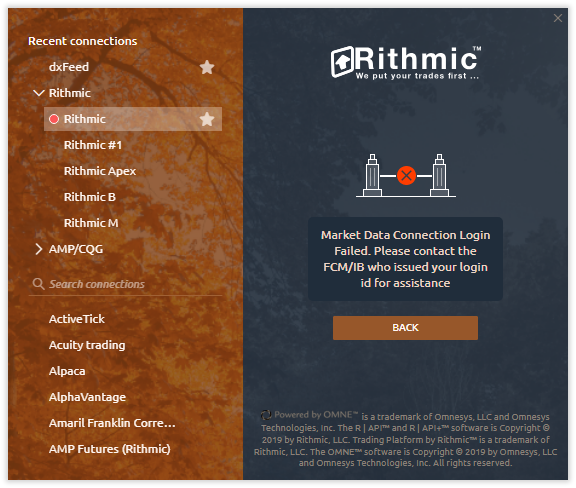

# Rithmic Issues

* [**Market Data Connection Failed. Please contact the FCM/IB**](https://help.quantower.com/quantower/connections/connection-to-rithmic/rithmic-issues#market-data-connection-failed.-please-contact-the-fcm-ib)
* [**No Level2 data for some symbols**](rithmic-issues.md#no-level2-data-for-some-symbols)
* [**Error: Only Admins Can Place Trades**](rithmic-issues.md#error-only-admins-can-place-trades)
* [**Error: No handle**](rithmic-issues.md#error-no-handle)
* [**Issue: No historical market data on a chart**](rithmic-issues.md#issue-no-historical-market-data-on-a-chart)
* [**Chart Data is incorrect or has gaps**](rithmic-issues.md#chart-data-is-incorrect-or-has-gaps)

## **Market Data Connection Failed. Please contact the FCM/IB**

Sometimes, when connecting to the Rithmic, you may see the error **"**_<mark style="background-color:green;">**Market Data Connection Failed**</mark>**".**_ Below we will describe possible reasons and solutions.


This error message is most commonly encountered by _**new Rithmic users for various reasons**_ and is not within the control of the Quantower platform.&#x20;


<figure><figcaption>
Rithmic error "Market Data Connection Login Failed"
</figcaption></figure>

### Connection to Rithmic can be done in two ways:

* **Directly**, <mark style="color:green;">**without**</mark> using **RTrader Pro** platform. This allows only one platform to be connected.

<figure><figcaption></figcaption></figure>

* <mark style="color:green;">**Through RTrader Pro**</mark>, using **Plugin Mode**, which lets you connect **multiple platforms at the same time (!)**.&#x20;

 (1) (1) (1).png>)

### Here are the most common reasons for connection errors:

* **Agreements not accepted**: You may have missed accepting the "_<mark style="background-color:orange;">Market Data Subscription Agreement</mark>_" or "_<mark style="background-color:orange;">Market Data Self-Certification</mark>_" during registration on Rithmic’s website or in RTrader Pro.\
  &#xNAN;_<mark style="background-color:green;">**Solution:**</mark> Log in to the RTrader Pro platform and accept the agreements._
* **New account**: If your account was created less than an hour ago, **full activation can take 30 minutes to 1 hour**.\
  &#xNAN;_<mark style="background-color:green;">**Solution:**</mark>_ _Log in to RTrader Pro. If the connection works, your account is fully activated._
*   **Wrong server, login & password**: Ensure you're connecting to the correct server and use correct login credentials without extra symbols (Apex, Topstep, or Rithmic).&#x20;

    _<mark style="background-color:green;">**Solution:**</mark>_ _Try switching servers that match your login. Check your login credentials._

<figure><figcaption></figcaption></figure>

*   **RTrader Plugin issue**: If Quantower was previously connected via the RTrader Plugin and RTrader Pro isn’t currently running or the "<mark style="background-color:orange;">**Allow Plugins**</mark>" option is disabled, Quantower won’t connect.

    \
    &#xNAN;_<mark style="background-color:green;">**Solution**</mark>**&#x20;****(several different options, not step-by-step):**_

    _1) start RTrader Pro in Allow Plugins mode and reconnect to your account in Quantower._

    _2) alternatively, try a direct connection by closing RTrader Pro, disabling the "**Use RTrader**" option in Quantower, and restarting Quantower._

 (1) (1).png>)

*   **Direct connection limitation**: When using a direct connection (without RTrader Plugin), you cannot use the same login on multiple platforms at once. If you try, the first platform may disconnect, and the second will fail to connect.

    _<mark style="background-color:green;">**Solution:**</mark>_ _use RTrader Plugin mode for multiple connections or close all platforms and connect to Quantower directly._

.png>)

* **Server unavailable**: If the Rithmic server is down, this error commonly occurs on weekends.\
  <mark style="background-color:green;">**Solution**</mark><mark style="background-color:green;">:</mark> _Wait until Sunday evening to try reconnecting._
* **Expired demo account**: Rithmic demo accounts are limited to 14 days. If you've used a demo before, you won’t be able to log in with a new demo username. Moreover, your account can be blocked by prop company because of drawdown limitation.
* **Persistent issues**: If you can't connect for several days, contact your broker or prop company.

If you’ve enabled "<mark style="background-color:green;">**Use RTrader Plugin**</mark>" in the connection settings but still can’t connect, check that you have more than one active session for market data.

.png>)

***

## No Level2 data for some symbols

<figure><figcaption></figcaption></figure>

This issue might be due to not having a subscription to Level 2 data. To check this, open the **RTrader Pro** platform and launch the _<mark style="color:green;">**Order Book**</mark>_ panel.

If you don't see Bid/Ask values in RTrader Pro, **you'll need to subscribe to this data through your broker or prop firm's support team**. Once subscribed, you'll also be able to see Level 2 data in our platform.

<figure><figcaption></figcaption></figure>

***

## Error: Only Admins Can Place Trades

**This means that your Evaluation account has failed and has been disabled.**&#x20;

This could be because you've reached your Trailing Threshold Drawdown or held a trade past 4:59 PM ET.

To resolve this issue, please contact the support team of your Prop Trading company.

***

## Error: No handle

The 'No handle' error typically occurs if <mark style="background-color:green;">**your login is already in use**</mark> on another platform or a different PC.\
To resolve this issue, ensure that you are not logged in with your credentials anywhere else, neither in Rtrader Pro nor any other platform. This step is crucial to prevent simultaneous login conflicts and to address the error effectively.

<figure><figcaption></figcaption></figure>

***

## Error: No trade routes

<figure><figcaption></figcaption></figure>

***

## Issue: No historical market data on a chart

Users may sometimes notice missing historical market data for one or more trading instruments on their charts. This is usually caused by an _**issue with the data provider**_, such as Rithmic, for a specific server, or by reaching the tick data download limit.


**NOTE:** Rithmic has a weekly tick data download limit of 40 gigabytes. Once this limit is reached, no historical data will be available until the next week, though real-time data will continue to work normally.


To diagnose and resolve this issue, follow these steps:

1. Check if the issue occurs with other trading instruments, especially standard futures contracts with month indications (e.g., ESH4, NQH4).

<figure><figcaption></figcaption></figure>

2. Reload data from the server by right-clicking on the chart and selecting '<mark style="background-color:orange;">**Reload history (server)**</mark>'.

<figure><figcaption></figcaption></figure>

3. If the problem persists, open the [<mark style="background-color:yellow;">**Event Log**</mark>](../../informational-panels/event-log.md) panel to view all types of error messages. If you see '<mark style="background-color:red;">**Permission Error**</mark>', confirm whether the issue is with Rithmic or your account.

<figure><figcaption></figcaption></figure>

4. Open (or install) the [<mark style="background-color:yellow;">**Rtrader Pro platform**</mark>](https://yyy3.rithmic.com/?page_id=16), the official platform of Rithmic. Log in with your account and open the <mark style="background-color:orange;">**Chart panel**</mark> with the exact ticker, for example, **ESH4.CME**.

<figure><figcaption></figcaption></figure>

5. If there is also no data on their chart, the issue likely lies with the Rithmic server. Contact support for your broker, prop trading company, or Rithmic directly. Include screenshots as evidence of the server-related issue.
6.  If your broker or prop firm confirms that you've reached the tick data download limit,&#x20;

    to avoid future blocks, we recommend:

    * Reducing the number of panels using numerous volume analysis tools (volume profiles, clusters).
    * Decreasing the depth of data on your charts (avoid loading more than 6 months of volume analysis data).
    * It is advisable to use the '**Reload data (server)**' option only when necessary and in moderation.

***

## Chart Data is incorrect or has gaps

Sometimes, non-market gaps can occur due to a weak Internet connection, a broken connection to your data provider, or other reasons. To solve this problem, **Right-click on the chart** and select **Reload history (server).**

<figure><figcaption></figcaption></figure>

<figure><figcaption></figcaption></figure>
