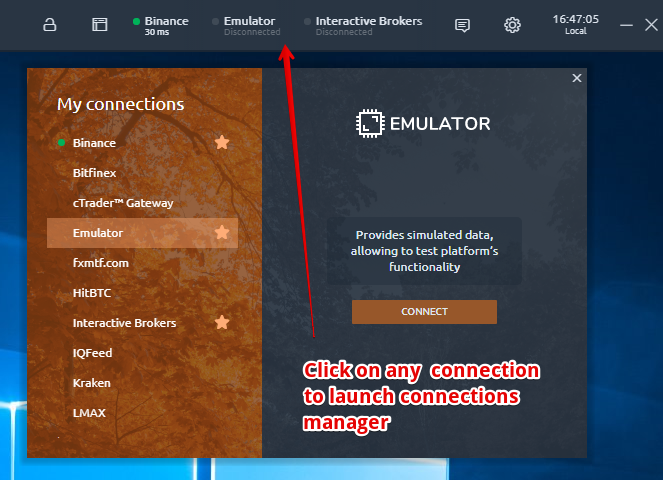
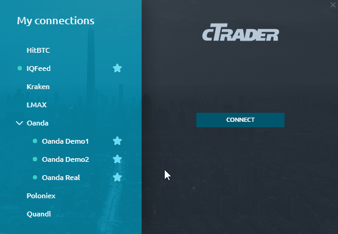
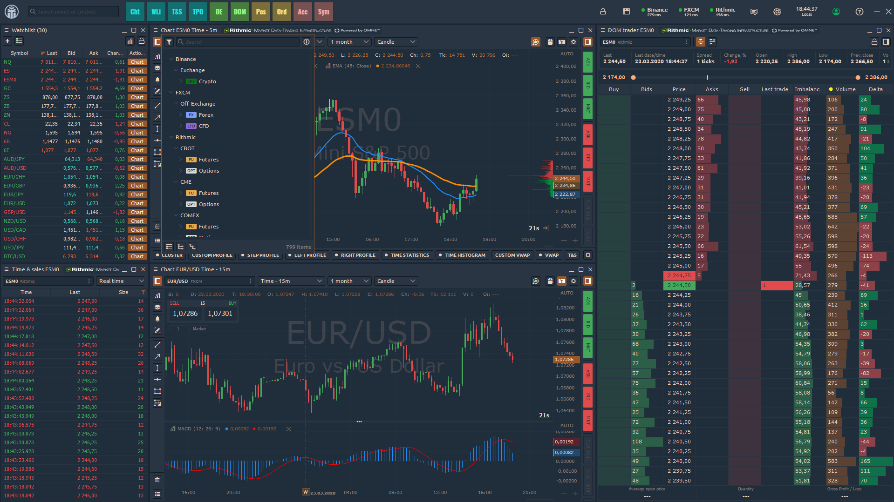

# Connections manager



Connections are integrations with third-party providers that supply various data: trading quotes, symbols history etc. 

## General information

**Connections manager** — is a screen that allows you to select from available integrations the ones you are trading with and connect to them using your accounts. While connecting to any integration, Connections manager remembers your login credentials and will use them for further auto-connects \(reconnects in case of errors\). If you don’t want to store your login credentials in manager, just click the “Lock” icon in the login form. 

Connections manager screen consists of two columns: connections list & connection info. Connection info column holds information about the active connection or Login form, in case if the current connection is not active.

Each active connection is marked with green Status dot by the left hand from its name. The "_**Star**_" icon indicates that connection is favorite and displayed on Control center toolbar. This icon is also used to **add/remove** a connection **from favorites**.

Connection login form varies depending on integration requirements. Usually, it has Login & password fields and “_**Connect**_” button. This button initiates the authorization process. Some integrations have settings \(a “_**Gear**_” icon on the right side of connection logo\) and account creation button \(a “_**User with plus**_” icon on the right side of “_**Connect**_” button\). Account creation redirects you to the integration vendor website.

Once connected, info column will contain the data about ping and current connection status text. There is a “_**Disconnect**_” button also.

## Multi-connect


Quantower supports multiple connections simultaneously, but this function available under paid licenses — Advanced Features, Crypto Package, Multi-Asset package and All-In-One License.


