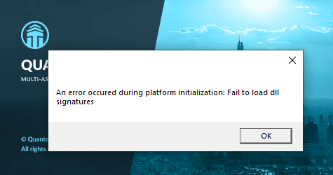

# General Errors

## How to Fix the ‘You’ll need a new app to open this ms-gaming overlay’ Error on Windows 10?

The easiest method is starting troubleshooting with simply **disabling Game Bar**. This could be helpful to remove the key combination and use it for other purposes.
 Now, you can take these steps:

* Press the **Win + I** combination key to open Windows Settings
* Go to **Gaming &gt; Gaming bar**.
* Switch the toggle of **Xbox Game Bar for things like recording game clips, screenshots, and broadcast using Game bar** to **Off**. Next, press **Win + G** to see if the error is solved.

More details you can find here [https://www.minitool.com/news/ms-gaming-overlay-popup.html](https://www.minitool.com/news/ms-gaming-overlay-popup.html)

## Error 'Application is already running'

* This message is displayed if you try running multiple Quantowers in parallel on the same computer or you have closed Quantower a few seconds ago and it did not finish closing yet. In 20 seconds or sooner Quantower can be started again.
* If even after a few minutes the platform fails to start, go to the **Task Manager**. Press **Ctrl+Shift+Esc** to open the Task Manager with a keyboard shortcut or right-click the Windows taskbar and select “Task Manager.” Find the process with the name **"Starter"**, select it and click on **End task**.

## An error occurred during platform initialization: Exception has been thrown by the target of an invocation

This error occurs due to the removal of the file by the **Avast antivirus or AVG antivirus**, which is necessary for the correct work of the platform. 

Our developers informed Avast and AVG companies that the file CefSharp.BrowserSubprocess.exe is a part of the CefSharp library — HTML5, JavaScript and PDF supported Web browser based on Chromium Embedded Framework. It allows using web browsing services in applications to create the user interface. We use this library in our platform as well. More information about it you can read here [https://cefsharp.github.io](https://cefsharp.github.io)

We don't know a reason why antivirus sometimes recognizes this file as suspicious, but if you search in google, you can see that there are already many reports from users about the same problem: [https://www.google.com/search?q=cefsharp.browsersubprocess.exe+antivirus](https://www.google.com/search?q=cefsharp.browsersubprocess.exe+antivirus) In general case antivirus developers recommend reporting a problem as false positive.

To be 100% sure, that this file is not dangerous, you can check it manually using different web services like [https://www.virustotal.com](https://www.virustotal.com) They will display your results received from different antiviruses.

As a solution, we recommend you remove Avast or AVG antiviruses \(completely\) and reinstall the platform.

## An error occurred during platform initialization: Fail to load dll signatures

This error can occur for several reasons:

* There is **no internet connection or a weak connection**. Please check that the connection is stable with your browser.
* The platform has **not fully installed the files** to work correctly. Please reinstall the platform.

