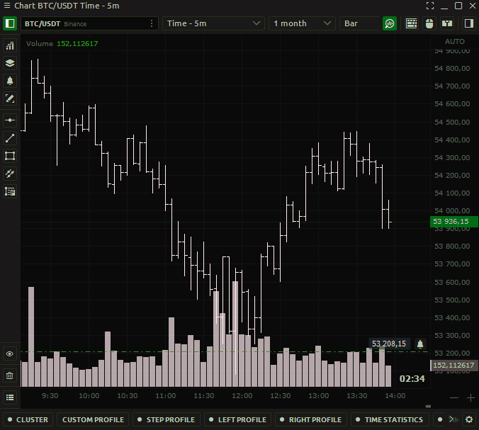
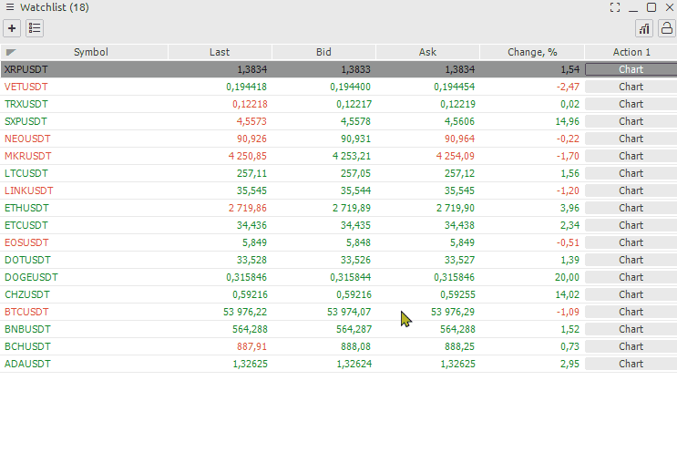
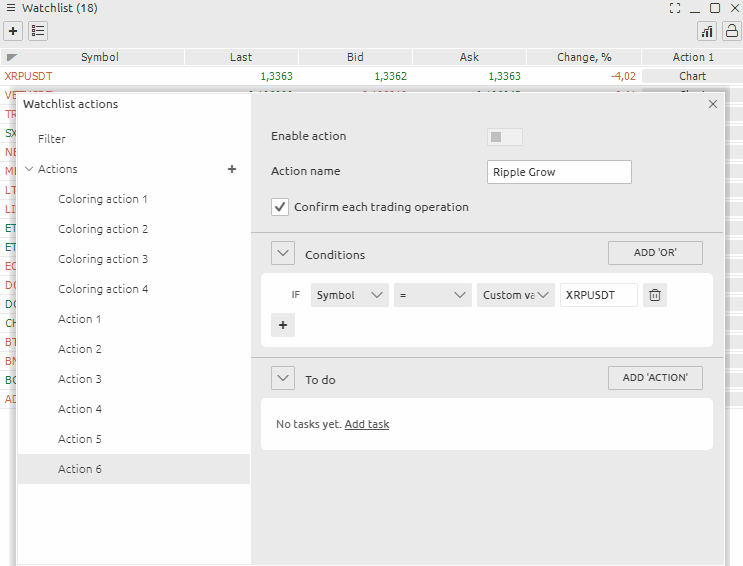

# Alerts

**Alert** on the financial market is a standard signal that notifies you when the price reaches a certain level on the chart, pre-set in the settings. A notification comes in the form of: sound, a notification opened on the monitor, a [telegram](../miscellaneous-panels/quantower-telegram-bot.md) email sent instantly as soon as the price has approached a specific value.

**Alerts** are already available by default in any Quantower. You can choose sound files for the Alerts from the offered ones or set your own signal that you like as a soundtrack. All the other options for alerts in Quantower, relevant to the usual graphic shapes - color change, drag and drop, double click menu call, etc.

### How to set up Quantower Alerts on chart

In the **alert settings,** you can specify single or multiple triggers. To make sure you don't miss an Alert, I leave the multiple triggers. This can be annoying at times. 

### Managing the alerts in Quantower

Sometimes you will have a lot of alerts. Use the Object manager to manage them. A double-click on an Alert will move you to the point on the chart where that Alert is set.You can also edit it or delete unnecessary alerts.


**Important:** The alert will only work on an open chart. If you switch the chart on which you set the alert from one symbol to another alert will not work


### How to set up Quantower Alerts on watchlist

[Watchlist](../analytics-panels/watchlist.md) panel shows brief pricing information on selected instruments, which you can group into lists. There are two ways to get to the settings menu. 

* From the menu of this window, select Setup Actions
* Right-click on the desired symbol and find Alert in the menu

And so let's look at how to set up an alert. To do this, we need to do a few actions. Activate the alert / Enable Action Give a name to the alert. Specify the symbol of interest. Add a condition. Select an action when the condition occurs


Do not forget to activate the Enable Action button


### How to copy conditions of Alerts

You can also copy the Alert state and change only some parameters, such as the symbol and its values

