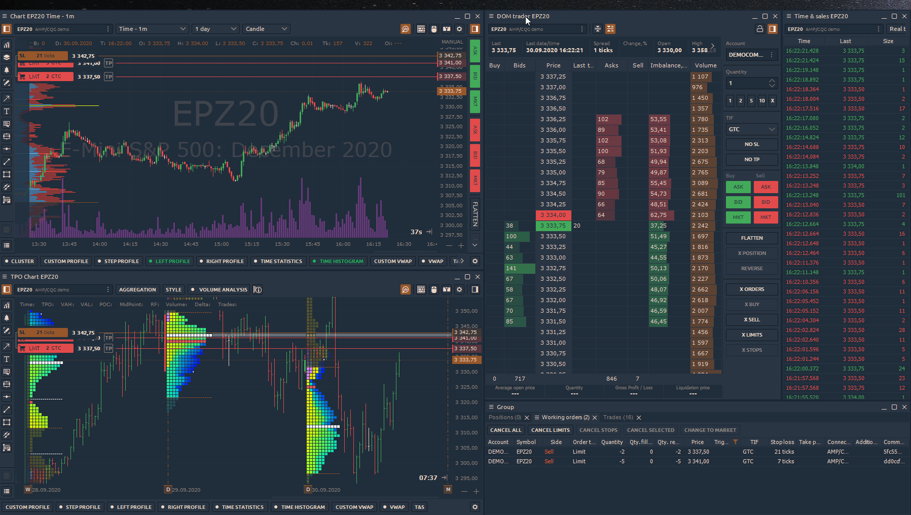

# Binds

The most innovative and, we are sure, a useful layer of panels organization — is **Binds** \(binding\). It was developed to allow a user to create its own “**Super-panels**” — the sets of basic panels that should be stuck together. Generally, Binds allows you to create any combination of panels in any required way; the only limit is your fantasy.

### How to Bind several panels

1. place several panels on your workspace close to each other;
2. select “_**Create bind**_” from any panel’s context menu \(this turns the Bind mode on\);
3. click on the panels, that you want to bind together or just hold the left mouse button and drag \("draw"\) over that panels to make them selected in one area;
4. press “_**CREATE BIND**_” button in the right-bottom corner of the Bind area \(or hit “Enter” button on your keyboard\); 
5. that is all — now you have your own Super-panel.


Keep in mind: intersected panels can’t be binded.


Each Bind acts as a single panel so when you resize it, it proportionally resizes all its containing panels. You may also drag the inner-separators to modify the dimensions between panels. Once you put some separators in one line, they will stick and resize as one.

In order to edit the contents of the Bind, you should unbind it using its context menu option “Unbind”.


Please notice that not all elements of Quantower can be binded. This feature doesn’t allow to combine screens like Connections manager, Settings. This restriction was made because of the impossibility to resize the Screens while binds should contain only the resizable items.


