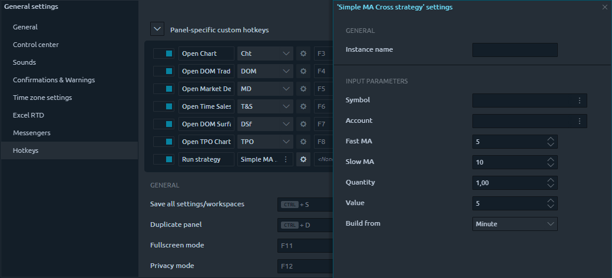

# Custom hotkeys

## How to create a custom hotkey?

You can find Custom hotkeys functionality in the [Chart](../analytics-panels/chart/) & [Watchlist ](../analytics-panels/watchlist.md)panels (for now) settings and the [General settings](general-settings-1.md) of the terminal. It is a separate collapsible block at the beginning of the Hotkeys section.

.png>)

To add some custom hotkey, you need to click the **\[+]** button on the top right corner and select a required action from the drop list. Please note that you can use most actions multiple times with different parameters (change to symbol, set period, place order, etc.). At the same time, some - are unique actions (Open specific panel, open [template](templates.md)).

After selecting an action, you will see the new hotkey settings row added to the list with a notification about the need to configure it before activating. Here you can set the name, select the action target, and, if available, set up additional settings. Next in a row comes a Hotkey combination field and a button to remove the whole row. As an alternative to deletion, you can also quickly disable the hotkey using the leading toggler.

### Place a custom order.&#x20;

This action is available in the General settings screen hotkeys. It lets you pre-configure some order and then send it instantly by pressing a specified Hotkey when using the terminal.

.png>)

Once added, this action requires to be pre-configured first. By clicking the **\[Gear]** button, you will get an [Order Entry panel](../trading-panels/order-entry/) where you should specify the order details and then click the **\[Save]** button. Now assign some hotkey for this action, and you are ready to go.


Please note that if you have turned off the order placement confirmation, the platform won't notify you when doing this using the hotkey also. You can enable notifications before order placement in the Confirmation & Warnings section of the General settings screen.


### Run strategy&#x20;

You can create a hotkey to start any available pre-configured strategy using the hotkey. Once you add this action in General settings hotkeys, you must patiently configure the strategy parameters first because it will be launched in the background when the corresponding hotkey triggers.

As in any other case with strategies management, you can see the list of active ones in a [Strategy runner panel](../quantower-algo/strategy-runner.md). There you can understand whether your strategy launched correctly and is working as you expected.&#x20;

### Worth to know&#x20;

* Panel-specific hotkeys are available for all panels of the same type&#x20;
* Panel-specific hotkeys trigger for the focused panel only&#x20;
* Global custom hotkeys trigger no matter in what panel of the platform you are working in
