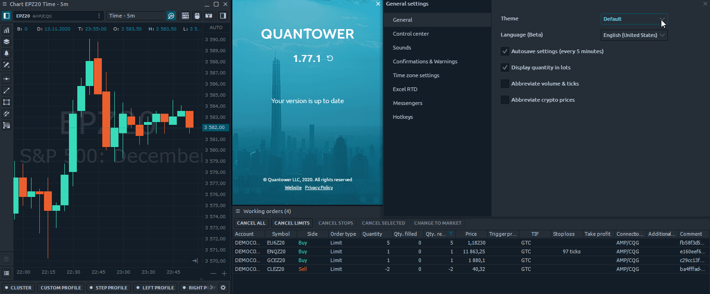
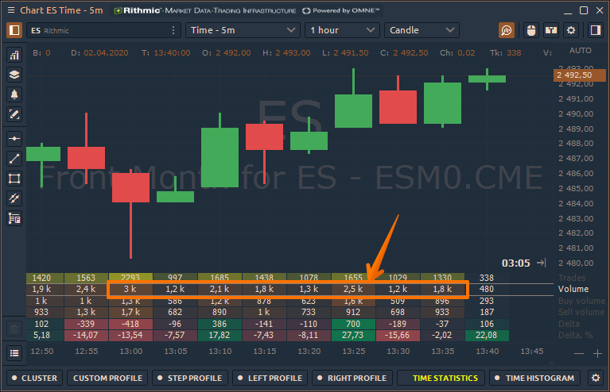
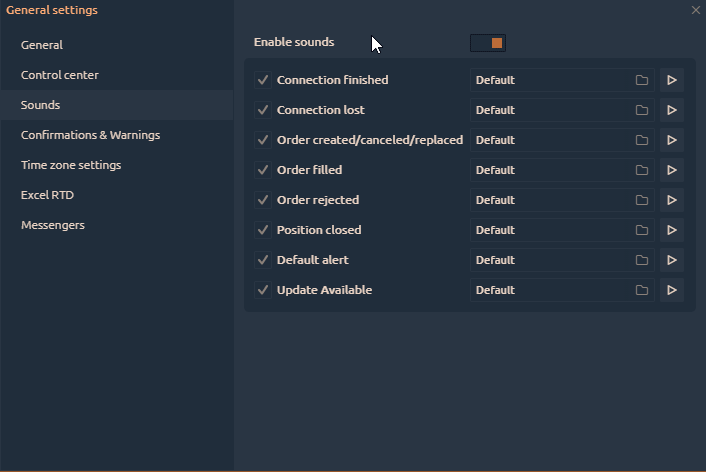

# General settings

Click on the **Gear icon** on the [main toolbar](main-toolbar.md) to open General Settings.

It is logically grouped into several tabs: 

* [**General**](general-settings-1.md#general)\*\*\*\*
* \*\*\*\*[**Control Center**](general-settings-1.md#control-center)\*\*\*\*
* \*\*\*\*[**Sounds**](general-settings-1.md#sounds)\*\*\*\*
* \*\*\*\*[**Confirmations & Warnings**](general-settings-1.md#confirmations)\*\*\*\*
* \*\*\*\*[**Time zone settings**](general-settings-1.md#time-zones)\*\*\*\*
* \*\*\*\*[**Excel RTD**](../miscellaneous-panels/excel-rtd-trading/)\*\*\*\*
* \*\*\*\*[**Messengers**](general-settings-1.md#messengers)\*\*\*\*
* \*\*\*\*[**Hotkeys**](general-settings-1.md#global-hotkeys)\*\*\*\*


Most settings are applied automatically, once you change them, but, in some cases, you will be prompted to confirm the changes apply; this action is required for complex settings, where the one change will influence a complex logic.


## General settings tab

**Theme** — Сhoose one of the 8 color schemes that suit you best

* Default Blue theme
* Dark Autumn
* Dark Forest
* Dark Gold
* Grayscale
* Light Forest
* Light Gold
* Light Water

**Language \(beta\)** — Quantower supports 17 languages. In case of errors or inaccuracies in translation, any user can make changes to the text. Read the manual on [how to make changes in the selected language](https://help.quantower.com/customization/localization).

**Default symbol** — specify a trading symbol that will open by default in all trading panels.

**Autosave settings \(every 5 minutes\)** — Quantower will save all changes of application settings in the "Settings" folder and overwrite them every 5 minutes while the application is active. It also saves on application close.

**Abbreviate volume & ticks** — this option displays the volume values or the number of ticks in a simplified form \(1K = 1 000; 10K = 10 000 etc.\)

**Abbreviate crypto prices** — this option displays the abbreviated values of cryptocurrency prices that have a large number of zeros.

**Unload inactive workspaces.** If this option is enabled, all previously created workspaces will not receive an update on market data. This will reduce memory usage.

**Hide part of an account name.** Specify the number of characters that will be hidden for your trading account name and ID. This option is used to keep the account private.

**Beta Version.** When this option is activated, you will receive updates to new functionality that is still in testing. We strive for our traders to use fully working functionality, but for this, we need the help of each user. Therefore, we ask as many people as possible to use the Beta version to inform us about possible bugs that eluded our testers.



## Control Center

Control center is the starting point of the platform, used as a launcher and informer simultaneously. And for optimal use of the space on it, we have added the ability to display/hide some controls.

## Sounds

Sounds are a good way of additional interaction with user allowing to inform about some activities even you don’t currently in front of your PC. Sounds can be enabled or disabled per certain action.

**Enable sounds** — activates or disables all of the application sounds globally

The group of actions in Quantower, when the sound should be played consists of the most vital situations in application usage. This list is not final and can be extended or changed later. Each option has a set of controls: 

* enable/disable checkbox
* action name
* sound path \(you can select your custom path to any **.wav** file\)
* prelisten button \(play/stop\)

## Confirmations

| **Confirm order placement** | true | Ask before placing an order |
| :--- | :--- | :--- |
| **Confirm order cancellation** | true | Ask before canceling an order |
| **Confirm order/position modification** | true | Ask before an order or position modifications apply |
| **Confirm position reversing** | true | Ask before reversing the position |
| **Confirm application close** | true | Ask before closing the Quantower terminal |
| **Confirm bind close** | true | Ask before closing the binds |
| **Show deal tickets** | true | Show the pop-up screens with the trading notifications |
| **Confirm hotkeys action** | true | Ask before making any action with Hotkey |

## Time zones

In case you are trading in various markets that are in different time zones, you will find it useful to switch the time indicator in [**Control center**](main-toolbar.md) to one of your favorite market times.

In Time zone settings group you can select what time zones are your favorite and should be displayed in a pop-up screen when you click the [**Time**](main-toolbar.md#time-and-time-zones) in **Control center**. Once you select several items from this list, you will then be able to switch between them easily.

## Excel RTD

Start from version 1.39 Quantower supports RealTimeData \(RTD\) for sending data and other market information to Microsoft Excel®. Read our guide about [how to enable and use RTD function with Quantower](../miscellaneous-panels/excel-rtd-trading/).

## Messengers

Quantower Alert Bot will send a message to your Telegram account about all events that you set in the platform. For example, set a price alert on the chart, and when the price will reach this level, a notification to the messenger will be sent.

To add a bot to the Telegram, open the platform's **General Settings -&gt; Messengers -&gt; Duplicate alerts to Telegram**.

Specify your personal chat ID, which you can find out by clicking on the **Get ID** button. A new Chat ID Echo bot will open and it will show _**"Your Telegram Chat ID is: xxxxxxx"**_  
Enter your chat ID in the corresponding field and then connect to the Quantower Alert Bot.

## Global Hotkeys

