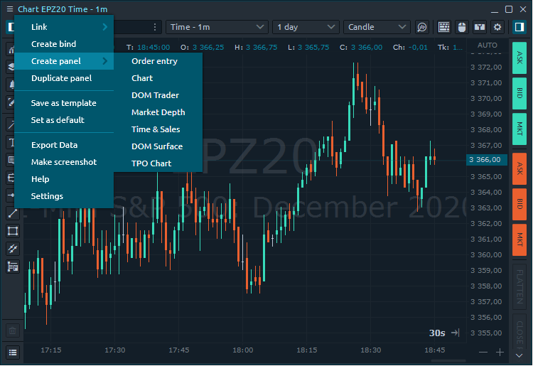

# Single Panel

Standalone panels are the minor elements of any Workspace and they behave just like any usual PC window:

* can be resized and positioned to any place on your screen;
* can stick to each other within their borders when they close enough;
* can stick its size to repeat the dimensions of other panels, while resizing;
* can be collapsed to the OS taskbar as usual windows

### Panel's context menu

Each panel has its own **context menu**, situated on the left upper corner, right before the Panel’s title.

This menu usually consists of the following functions:

* **Link**. Allows linking several panels by common symbol using the Color definition. Just select one link color in two panels and they will have a synchronized symbol parameter. Once linkage is applied, the panel’s title will be colored to the respective color.
* \*\*\*\*[**Create bind**](binds.md). Combining several panels in Super-panel. More in [_Binds section_](binds.md).
* **Create panel.** Opens a new panel by the current symbol
* **Duplicate panel**. Just creates one more totally similar panel.
* \*\*\*\*[**Save as template**](https://help.quantower.com/getting-started/templates). Customize the panel, combine in a group or Bind and save as template.
* \*\*\*\*[**Save as default**](https://help.quantower.com/getting-started/set-as-default)**.** Each panel type has its own settings by Default. You can tune them whatever you want and even make your personal defaults. Just select “_**Set as Default**_” option, and Quantower will store your current panel’s settings and will apply them for each newly opened panel of this type.
* \*\*\*\*[**Setup Actions**](../analytics-panels/time-and-sales.md#setup-actions-filters-and-actions) \(only for table panels like Watchlist, Time & Sales, Positions, Working Orders etc.\). This option allows you to set Alerts and advanced filtering to values in the table.
* **Export Data.** Saving the data from a chart or table to an external CSV file. You can save Price data, indicator values, values in tables.
* **Make Screenshot.** Creates and copies a screenshot of the panel to the clipboard for its further paste into the social network.
* **Help**. If you have questions about working with the panel or specific functionality, click on this link and you will immediately redirect to the documentation for this panel.
* **Settings**. Personal settings per each panel. Opens a Settings screen where you can tune your panel as you like and then, in case of need, save these settings as Defaults.



