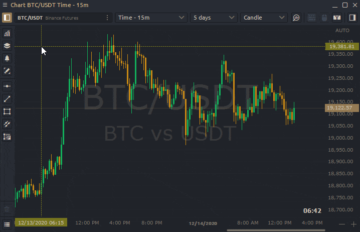

# Single Panel

Standalone panels are the minor elements of any Workspace and they behave just like any usual PC window:

* can be resized and positioned to any place on your screen;
* can stick to each other within their borders when they close enough;
* can stick its size to repeat the dimensions of other panels, while resizing;
* can be collapsed to the OS taskbar as usual windows

### Panel's context menu

Each panel has its own **context menu**, situated on the left upper corner, right before the Panel’s title.

This menu usually consists of the following functions:

* **Link**. Allows linking several panels by common symbol using the Color definition. More details in the [_**Linking section**_](link-panels.md)**.**
* \*\*\*\*[**Create bind**](binds.md). Combining several panels in Super-panel. More details in [_**Binds section**_](binds.md).
* **Create panel.** Opens a new panel with the current symbol.  You can open the following panels: [**Order Entry**](../trading-panels/order-entry/)**,** [**Chart**](../analytics-panels/chart/)**,** [**DOM Trader**](../trading-panels/dom-trader/)**,** [**Market Depth**](../trading-panels/market-depth.md)**,** [**Time&Sales**](../analytics-panels/time-and-sales.md)**,** [**DOM Surface**](../analytics-panels/dom-surface.md)**,** [**TPO Chart**](../analytics-panels/tpo-chart.md)**,** [**Symbol Info**](../informational-panels/symbol-info.md)\*\*\*\*

* **Duplicate panel**. Just creates one more totally similar panel \(full copy\).
* \*\*\*\*[**Save as template**](templates.md). Customize the panel, combine in a group or Bind and save as a template.
* **Apply template.** Once you created several templates you can apply any of them to this particular panel.

* \*\*\*\*[**Save as default**](set-as-default.md)**.** Each panel type has its own settings by Default. You can tune them whatever you want and even make your personal defaults. Just select “_**Set as Default**_” option, and Quantower will store your current panel’s settings and will apply them for each newly opened panel of this type.
* \*\*\*\*[**Setup Actions**](setup-actions-and-advanced-filters.md) \(only for table panels like Watchlist, Time & Sales, Positions, Working Orders etc.\). This option allows you to set Alerts and advanced filtering to values in the table.
* \*\*\*\*[**Export Data.**](../miscellaneous-panels/history-exporter.md#how-to-export-historical-data-via-other-panels) Saving the data from a chart or table to an external CSV file. You can save Price data, indicator values, values in tables. Also, you can use the [**HISTORY EXPORTER**](../miscellaneous-panels/history-exporter.md) panel.

* **Make Screenshot.** Creates and copies a screenshot of the panel to the clipboard for its further paste into the social network.
* **Help**. If you have questions about working with the panel or specific functionality, click on this link and you will immediately redirect to the documentation for this panel.
* **Settings**. Personal settings per each panel. Opens a Settings screen where you can tune your panel as you like and then, in case of need, save these settings as Defaults.

