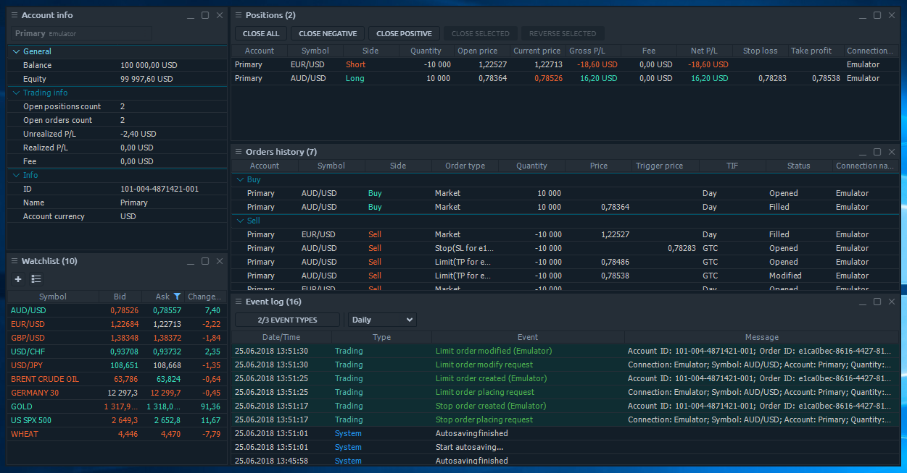
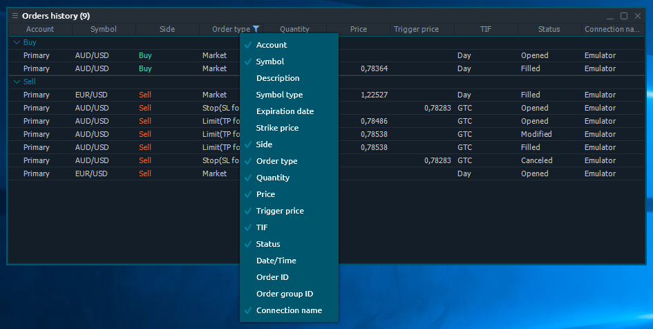
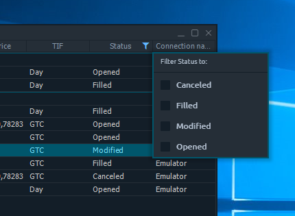
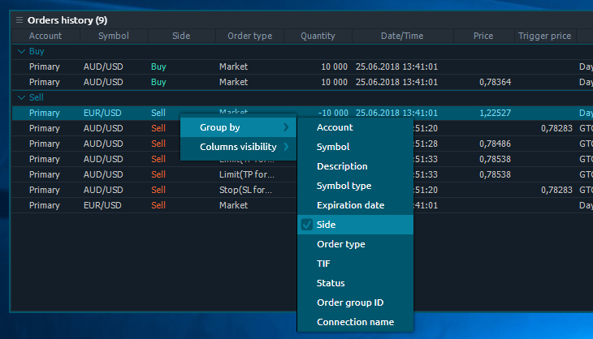

# Table management

### Table panels

Table panels are represented as a separate class — they all have at least 99% functionality based on the table view. We use the common table component for all of these panels, so the behavior and features are mostly the same.

Some table panels have a special toolbar that can be used for Mass-filtering or Quick actions. Other table panels can have no column headers because they don’t really need for understanding the data, thus were hidden to save space; this disables an ability to filter column data in such panels.

### Columns management

Data in table panels are organized in rows and columns, where each item’s \(row\) parameters are displayed in columns. Not all of the available columns are displayed by default in each table panel. We have selected the most popular and vital per panel and made an ability to modify the columns set as you like.

Right-click on any column header to see the “_**Column set**_” context menu. Then click on any item in this menu to switch the column’s visibility. You can disable up to 1 column minimum; the last visible column won’t be available to hide. 

Other useful features of column management are sorting and resize. Each column can be dragged by its header between other columns inside the table in order to set the required sequence. You can also drag the vertical borders between two columns to resize them.

### Filtering

The set of rows in the table can be filtered by some data value in their column. There are two ways to apply the filtering: 

* Quick table filter
* Advanced table filter


Quick table filter is just another point of access to advanced filtering option, allowing to apply simple filters in several clicks.


Quick table filter can be accessed by clicking the “_**Filter**_” icon in any table column’s header.

Depending on the data type in a column, the Quick filter will give you the corresponding form for input; currently “_**String**_”, “_**Date/time**_” & “_**Number**_” filtering are supported. Once you select some option — the table rows will be filtered to that ones, containing the selected value. Quick filter can be cancelled by pressing “_**Cancel filtering**_” option.

### Sorting

Each table can be sorted by column value. To sort the table, click on column’s header; you will see a “_**Sorting**_” icon appears. The next click on this header will revert the sorting by this column. You can sort your table only by one column simultaneously.

### Grouping

If you want to organize your rows more precisely, you can use a “_**Rows grouping**_” feature. It allows separating all table items in groups, made from data of some column. Currently, only “_**String**_” data columns are supported for grouping.

To apply the grouping just right-click on the table body and find an option “_**Group by**_”; the second-level of context menu will contain all of available columns that can be grouped by. You can group by one column only. To cancel grouping — follow the previous steps and uncheck the column.

