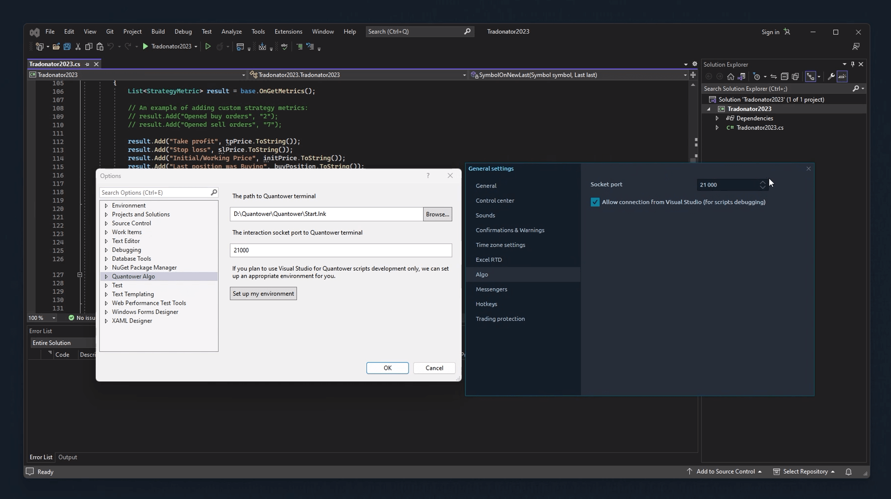
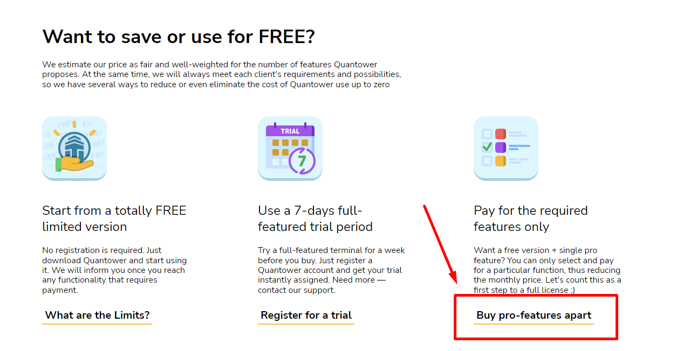
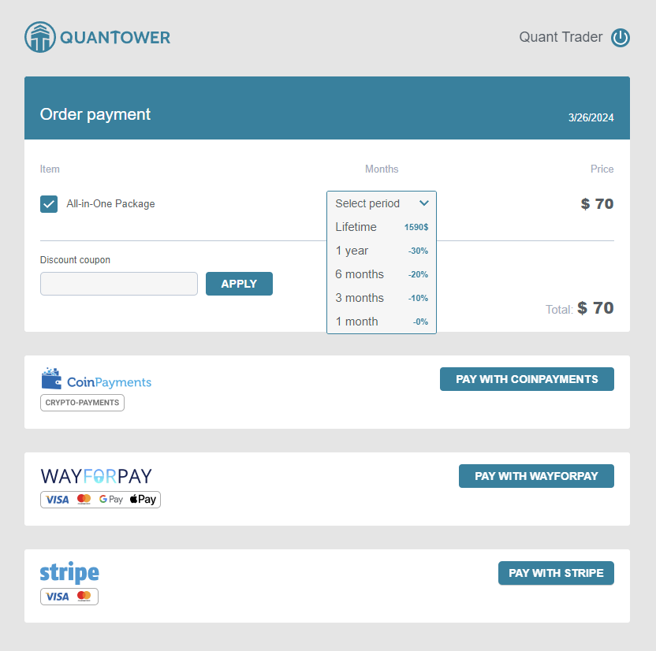
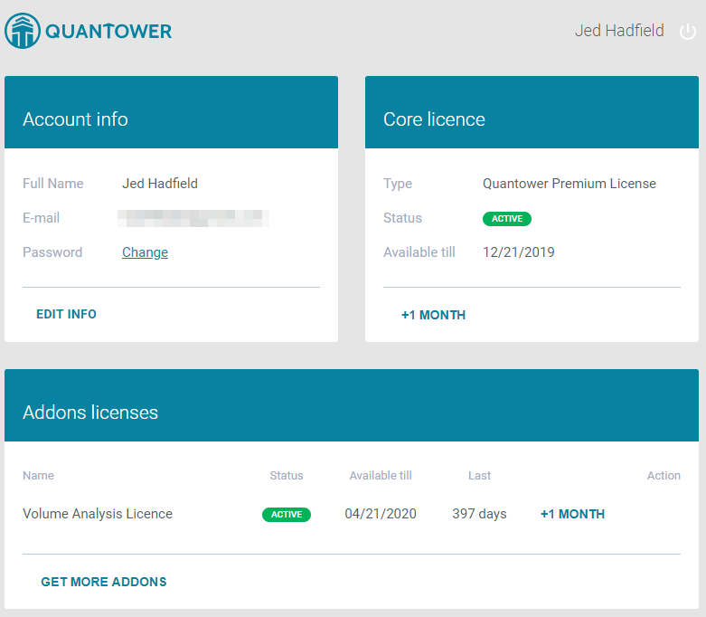

# Quantower Licenses

Quantower gives you the most popular trading and analytics tools for free. A handful of advanced, market-specific features live under a paid license.


Questions about your account or a license purchase? [Contact our Support team](https://www.quantower.com/contact-us).


Any paid license is tied to an active [Quantower Account](quantower-account.md) — and if you don't have one yet, you can create it right during checkout.



## All-in-One license

Two choices, depending on what you need: the <mark style="color:green;">**Free version**</mark> covers all the essentials, and the <mark style="color:$success;">**All-in-One license**</mark> unlocks the advanced tools for serious trading. Here's what All-in-One adds:

* **Every connection at once** — all major exchanges, brokers, prop firms, and data feeds, used simultaneously.
* [**Volume analysis tools**](https://www.quantower.com/volumeanalysistools) — Cluster chart, Volume Profile, Time Statistics, Time Histogram, and VWAP.
* [**Advanced features**](https://www.quantower.com/advancedfeatures) — Renko, Kagi, P\&F, and Heikin-Ashi chart types, unlimited overlays and indicators, Trading Simulator, and chart/indicator alerts.
* [**DOM Surface**](https://www.quantower.com/blog/dom-surface-panel-for-deep-order-flow-analysis) — full market-depth view for deep order-flow analysis.
* [**Power Trades Scanner**](https://help.quantower.com/quantower/analytics-panels/chart/power-trades) — spots large orders executed in a short window. (In the free version, its data clears after 3 minutes.)
* [**Options Trading**](https://www.quantower.com/options-trading-features) — activates the Options Analytics panel, currently free to use.
* New features land in your account automatically as they're released.

## Using Quantower for free

You've got three ways to run Quantower at no cost.

### Free Edition (no registration)

Just download and go. You get a capable version for trading and analysis, with a few limits:

* Two indicators per chart
* One symbol overlay per chart
* One active connection (broker, prop firm, data feed, or crypto exchange)


Want the full breakdown? See the [license comparison table.](license-comparison.md)


Quantower can be operated indefinitely in this specific mode, allowing users to leverage its features without any time constraints.

### 7-day full-featured Trial period

To access all the features of the All-in-one version of Quantower, you can take advantage of the 7-day trial period. To do this, you must [register for a free Quantower account](quantower-account.md) and log in via the application. Once you confirm your account via email, the trial period will be automatically granted.

### Free version + one pro feature

If you want to purchase specific pro features instead of paying for the entire package, you can download and register for a Quantower account. Afterward, you can select and purchase the desired feature by clicking on the "Buy pro-features apart" link on the pricing page. This way, you can use the free version of Quantower along with the particular pro feature you require.

<figure><figcaption>
The way to customize your pro-features set for Quantower
</figcaption></figure>

## License terms

You can purchase a license for as little as one month or a longer term of three months, six months, one year, or even a lifetime. This allows you to select the duration best suited to your requirements. The one-month license is ideal as a trial, while the longer-term licenses are perfect for ongoing access.&#x20;

### Lifetime term

A lifetime term gives you access to an All-in-one license or a particular feature license for the duration of the Quantower terminal's existence, including all future updates and functionalities covered by the license.

With a lifetime license, you can enjoy uninterrupted access to our Quantower without worrying about renewals or additional payments.

## How to Purchase a License on Quantower

#### Selecting a License

1. **Navigate to the** [**Pricing page**](https://www.quantower.com/pricing)**.** Here, you can upgrade your Free license.
2. **Choose your preferred license and its duration.** Click the **BUY** button to proceed.

#### Logging In

3. **Log into the Quantower service.** Use your email and password for authorization. If you're a new user, follow the onsite [instructions to create an account](quantower-account.md#account-creation).

#### Finalizing Your Purchase

4. **Review your purchase cart.** It will display your selected license type, term of validity, and total price. You can adjust the term of validity at this point if you wish.
5. **Select a payment provider.** Click the **Pay** button corresponding to your chosen provider to complete the payment process.

After successfully logging in and making your selection, you will be redirected to the purchase cart to finalize your purchase.


You can make payments through direct bank transfers. Please [contact our support team](https://www.quantower.com/contact-us) for further details.


After completing the payment on the provider's page, you will be redirected back to the Quantower Accounts confirmation page. To access your Quantower Account dashboard, click on the **GO TO DASHBOARD** link. Here, you'll find your Core License details and a history of your payment transactions.

## Quick tips on License purchase

* Your Quantower Account comes with a free license that remains valid as long as your account is active.
* Any paid license remains active from the purchase date until the end date, also known as the "Available till" date.
* After the paid license expires, the account will be automatically downgraded to the free license level.
* Every additional purchase of a similar license type extends the "Available till" date of the existing license.
* Currently, it is impossible to subscribe or make automatic payments.
