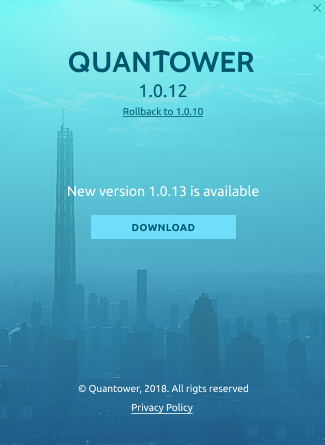

# Application updates

Quantower — is a constantly developing application that is why you can be sure to open more and more useful features each day. Our team strives to release the new updates as soon as possible, usually at least several times per month.

Quantower automatically checks for updates on start and re-checks them every 10 minutes in background; this helps you to get known about the latest updates just after we release them.

If Quantower knows that the new update is available, it will indicate it by coloring the “_**Logo**_” icon in Control center panel; it will become green and flashing. If you see this — click on it and open the sidebar, then press the “_**NEW VERSION**_” green button at the bottom and get on About screen.

Now you can press the "_**DOWNLOAD**_" button and Quantower will download the latest version and prepare it for the update. When the download process will be finished, Quantower will ask you about the restart. This action is required to apply the new version but you can cancel the restart and proceed using an application. In this case, updates will be applied on the next start of Quantower.


Notice. If you accept an application restart for the update, it will close and reopen with the new version. This may take some time and trading will be unavailable.


All of your local settings will be saved and applied for future updates because the update changes the Core files only.

