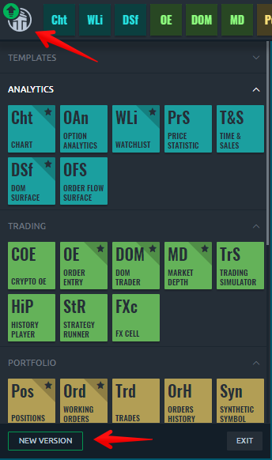
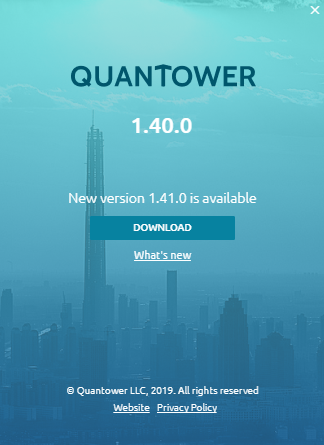
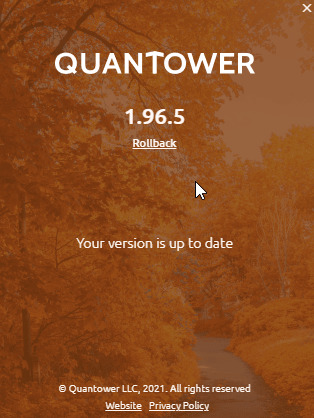
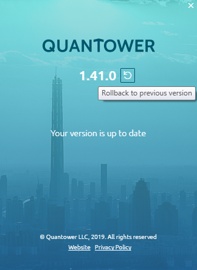

# Platform update

Our team strives to release the new updates as soon as possible, usually at least a couple of times per month.

Quantower automatically checks for updates on start and re-checks them every 10 minutes in the background. It helps you to get to know about the latest updates just after we release them.

A green arrow will appear near the logo when a new version is available. Сlick on the "_**Logo**_" icon and open the sidebar, then press the “_**NEW VERSION**_” button at the bottom and get on the About screen.

Press the "_**DOWNLOAD**_" button, and Quantower will download the latest version and prepare it for the update. When the download process is finished, Quantower will ask you about the restart. This action is required to apply the new version, but you can cancel the reboot and proceed using an application. In this case, updates will be applied on the next start of Quantower.


If you accept an application restart for the update, it will close and reopen with the new version. This may take some time, and trading will be unavailable.


All of your local settings will be saved and applied for future updates because the update changes the Core files only.

If you use the platform with a too old version, it will ask you to update it to the latest version to avoid any issues with connections and trading operation.

## Rollback to the previous version

The rollback function allows you to go back to any previously supported version and switch to it in a few clicks.

