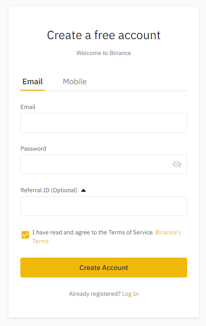
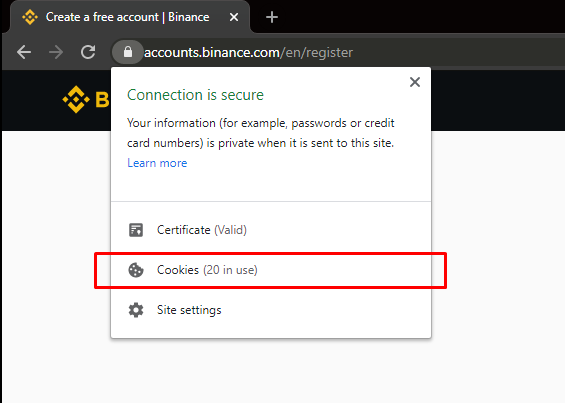

# Binance fresh account

As [stated in our article](https://www.quantower.com/blog/quantower-participates-in-binance-broker-program), it is possible to use Quantower premium features for free when connected to Binance exchange. That is why, in order to start using Quantower premium without charge, you need to accomplish some steps as follows.

## **Create a fresh Binance account**

First, you need to register a new account on Binance exchange, that wouldn’t be connected with any referral previously. In order to do this, please follow the [https://accounts.binance.com/en/register](https://accounts.binance.com/en/register) link and fill in the registration form.


Please note! The Referral ID field must be empty. If you see any prefilled ID in this field you should CLEAR YOUR **REFERRAL ID** COOKIES in the browser before registration.


## Clearing Referral ID cookies

To clear your saved cookies in the Chrome browser, you should proceed to the “Site information block” and follow the “Cookies section”

Now select each group of cookies and press the “Remove” button. When there will be no cookies in the list, please, press the “Done” button. Now you should refresh your registration page and make sure that the “Referral ID” field is empty. 

When you’ve created a new account with the Binance exchange you may log in using your new credentials via the Quantower terminal and start using all of its premium features for free.

