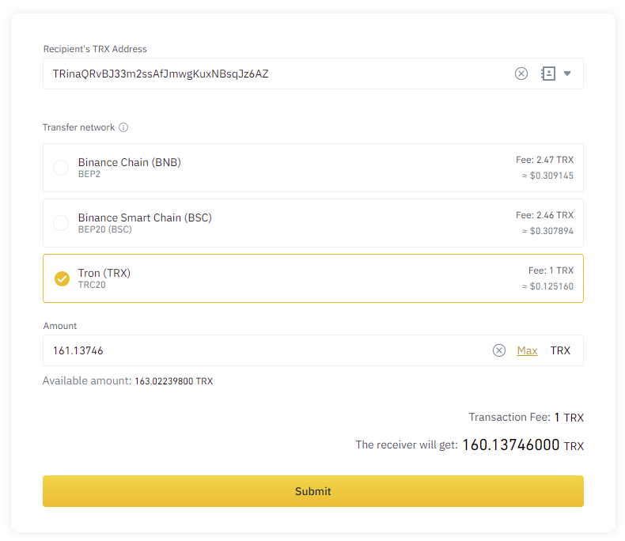
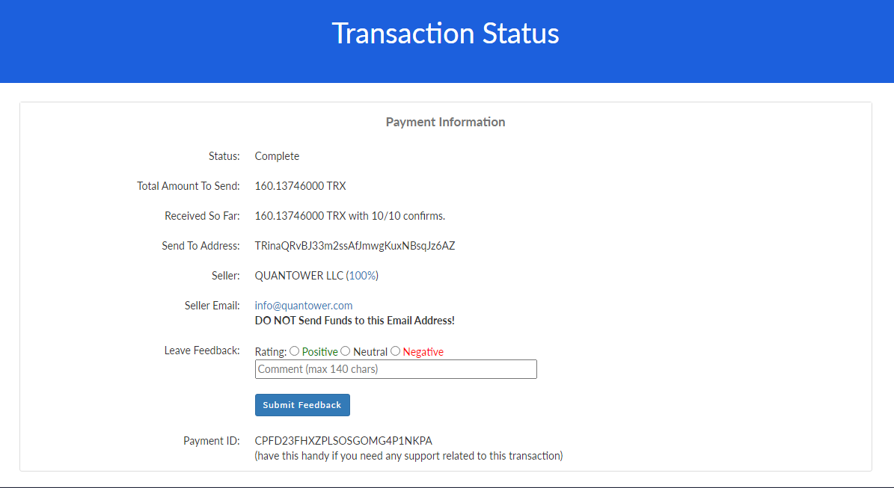
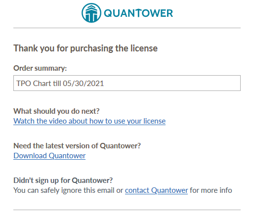

# “Coinpayments” payment

While the process of coins transfer between digital wallets is pretty usual and straightforward, we decided to mention some additional aspects of Quantower license purchase using crypto coins.

When you decide to pay for a license using your crypto-assets, you should press “Buy” for the required feature. Next, you should click “Pay with Coinpayments”. Now, you will be redirected to Coinpayments merchant where you should select a coin and then — “Complete Checkout”. You can register here, but it is not necessary.

Here we would like to share some advice:


**There can be a commission for transfer**, depending on what coins you transfer and from what wallet. That’s why make sure you will transfer enough quantity of coins \(including commission\) to finish your payment. In case you send fewer coins than Coinpayments asked, you can fulfill the lack amount with an additional transfer.



**Transfer time and a number of approvals differ from coin to coin**. Bitcoin requires many approvals and time to transfer, some less popular coins are transferred much faster. Sometimes it is worth it to buy some alt-coin and pay using it to speed up the purchase process.


## Purchase details page


Next, you will be redirected to the temporary payment page that will be active for 2 hours. During this time you should transfer the selected coin to complete the purchase. We recommend you to stay on this page until you will see the successful purchase message. 

There are some important items on this page:

* **Payment ID**. Copy & save it somewhere, in case some technical fail \(your PC turns off and you won’t reach this page\). This ID is needed to contact Coinpayments for further transaction support.
* **There is a transaction status page link**, where you can track the process of coin transfer \(approves, amount, etc.\). That page updates automatically.

## Make a transfer

Now you need to make a transfer of the selected coins from your wallet. This process depends on where you are sending from. As an example, you can see how Binance informs about commissions and receiving amounts after transfer:

Let’s say that you’ve sent your coins and now waiting for the license assign. **The confirmation process usually takes 10-45 minutes** but varies based on the coin's target block time and the number of blocks confirms required. If you see that your coins were successfully sent from your wallet, it is not stated that Coinpayments already received them. If your payment lasts more than 30 minutes - please contact our support.

## License assignment check


There are some technical processes in the Coinpayments that should be accomplished before they inform us about the successful payment. These require time, so **your license can’t be assigned to your account until we get approval from Coinpayments**. Even if there is a Completed status.

**To check whether your license was assigned to your account**, you should monitor the following sources:

* your account’s email address, where you should receive a notification about the successful payment;
* in your [Quantower account panel](http://accounts.quantower.com), in the Payments History section.

Once we receive approval from Coinpayments, we will immediately assign you a license and send you a confirmation email about the successful purchase. From this moment you can use your advanced feature.  

