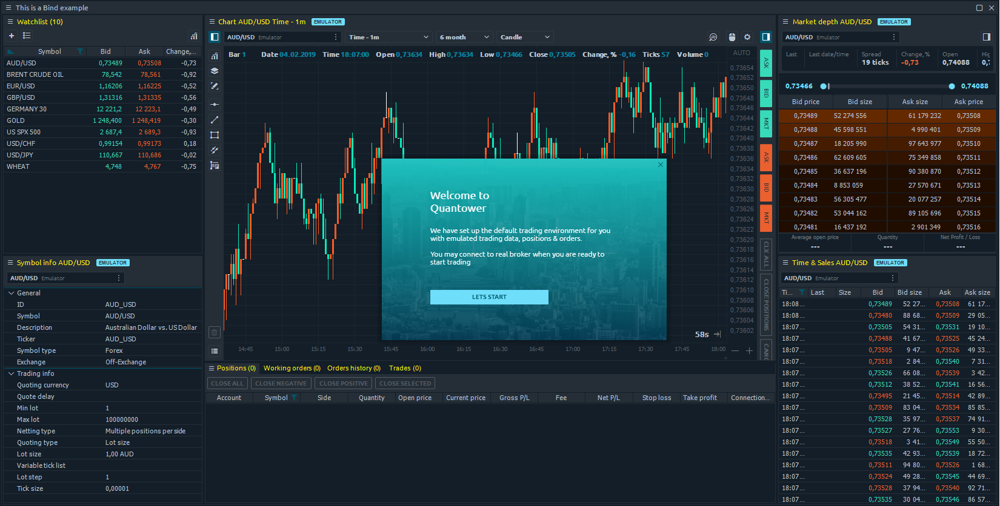

# First start

The first start of Quantower terminal brings you the testing environment with the key trading features allowed. This state can be called DEMO-mode, but in spite of other platforms, Quantower doesn’t require you to register in order to try. Once the platform was launched, you will get several elements of the platform, automatically created for testing purposes: 

* \*\*\*\*[**Workspace**](https://help.quantower.com/getting-started/workspaces-binds-groups#workspaces)
  ****
* **"**[**Bind**](https://help.quantower.com/getting-started/workspaces-binds-groups#binds)**"** with several most popular trading panels
* An active [**connection to Emulator**
  ](https://help.quantower.com/connections/emulator-demo-mode)
* An opened positions \(can be seen in positions panel\)

From this point, you can start using Quantower. Try to customize the workspace, open new panels or create your first orders.

## Emulator connection

An emulator is a DEMO connection, available in Quantower connections screen. Technically, it is a special module of Quantower’s core, that provides generated quotes and emulates a trading process. This means that once you've connected to Emulator, it will start to produce the fake quotes for a limited list of symbols. _**Just for testing purposes!**_


Please note! Emulator consumes a certain amount of resources of your PC, so it can influence its performance. We recommend you to disconnect in case you don’t use it.


## Quantower Free version

By default, you will be using Quantower platform in free version, where you have a limited functionality. The list of features, that available in FREE version you can find on a [Pricing page of Quantower website](https://www.quantower.com/pricing).

