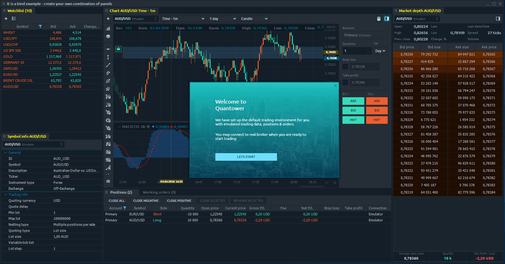
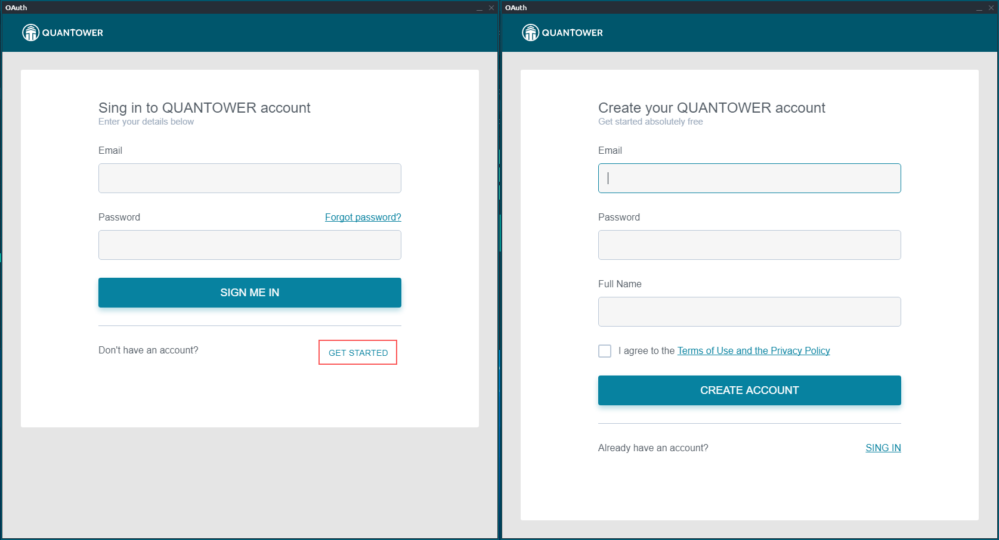

# First start

The first start of Quantower terminal brings you the testing environment with the key trading features allowed. This state can be called DEMO-mode, but in spite of other platforms, Quantower doesn’t require you to register in order to try. Once the platform was launched, you will get several elements of the platform, automatically created for testing purposes: 

* Workspace
* "Bind" with several most popular trading panels
* An active connection to Emulator
* An opened positions \(can be seen in positions panel\)

From this point, you can start using Quantower. Try to customize the workspace, open new panels or create your first orders.

## Emulator connection

An emulator is a DEMO connection, available in Quantower connections screen. Technically, it is a special module of Quantower’s core, responsible for trading data generation. This means that once you connect to Emulator, it will start to produce the dummy quotes for a limited list of symbols; just for testing purposes.


Please note! Emulator consumes a certain amount of resources of your PC, so it can influence its performance. We recommend you to disconnect in case you don’t use it.


## DEMO-mode possibilities

Due to the special DEMO-mode enabled while your first start, you have a limited functionality in Quantower terminal. The list of features, available in DEMO-mode:

* Workspace modification
* Open Panels
* Create binds, groups of panels
* Open orders for Emulator’s symbols
* Managing positions
* Using the Basic features of each panel
* Global settings modification

In other words — you have an ability to try the most functions of Quantower. And don’t afraid to try them all; you will be notified about the necessity to Sign in to your Quantower ID, once you reach some advanced function. 

## Quantower ID

In case you decided to get more features or ready to use Quantower for real trading, you need to Sign in to your Quantower ID. The registration process is free and should take less than 2 minutes to accomplish.

### Registration

First-time registration will require your email \(please use the real email, as it will be used as your login\), password and Full name \(so we know how to name you\). Press the “_**Log in**_” button in Control center sidebar \(or in pop-up notification\) and follow the “_**GET STARTED**_” link.

After you finish Registration, you will be required to confirm your email address by clicking the link in confirmation email from Quantower team, that should come to your email. Now you a ready to Sign in to your ID in Quantower terminal.

### Sign in

Open Control center sidebar and press “_**Sign in**_” button. Fill-in the form and press “_**SIGN ME IN**_”. That’s all. Now you have an access to the Quantower terminal using the Basic license — a free license, assigned to your ID just after you confirmed your email. This license doesn’t require any further actions from you and is granted to all registered users.


Quantower will store your ID credentials and will sign you in automatically on platform start.


### Sign out

In case you want to sign out from your ID just follow the “_**Log out**_” link in Control center sidebar. Once being signed out, Quantower will be limited to DEMO-mode functions.

