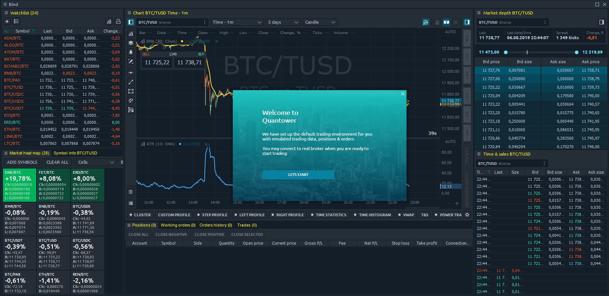

# First start



During the first start of Quantower terminal you will get several elements of the platform, automatically created for testing purposes: 

* \*\*\*\*[**Workspace**](https://help.quantower.com/getting-started/workspaces-binds-groups#workspaces)
  ****
* **"**[**Bind**](https://help.quantower.com/getting-started/workspaces-binds-groups#binds)**"** with several most popular trading panels
* An active **connection to Binance with Info Mode**

From this point, you can start using Quantower. Customize the workspace, open new panels. For sending trading orders you need to swith to other trading connection like [OANDA](../connections/connection-to-oanda.md), [Interactive Brokers](../connections/connect-quantower-to-interactive-broker.md). 

## Quantower Free version

By default, you will be using Quantower platform in free version, where you have a limited functionality. The list of features, that available in FREE version you can find on a [Pricing page of Quantower website](https://www.quantower.com/pricing).

