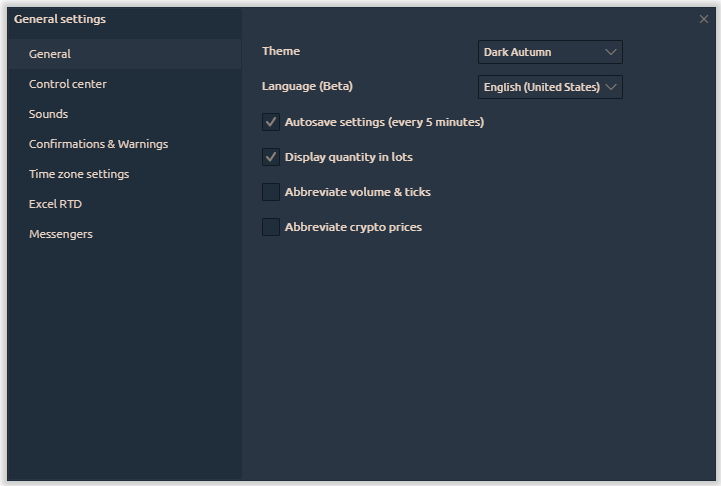
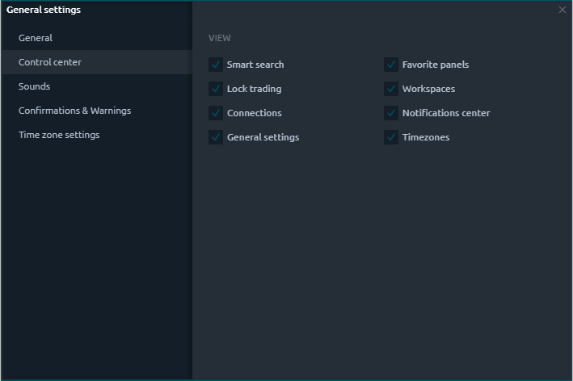
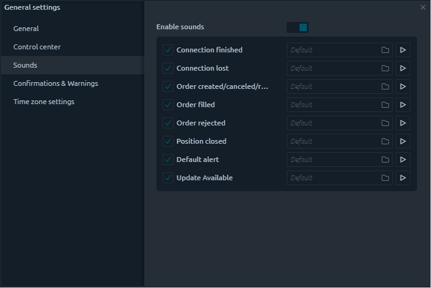
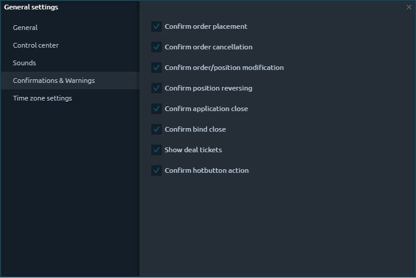
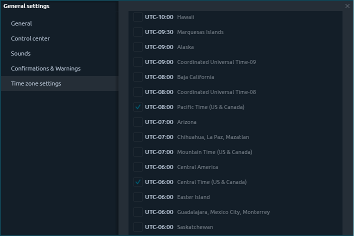

# General settings

## General info

General settings — is a screen, where you can set up the most common behavior of the whole Quantower application. It is logically grouped into several tabs: 

* General
* Control Center
* Sounds
* Confirmations & Warnings
* Time zone settings


The most settings are applied automatically, once you change them, but, in some cases, you will be prompted to confirm the changes apply; this action is required for complex settings, where the one change will influence a complex logic.


General settings are backed up automatically every 5 minutes by default and you can control this behavior in the General tab.

## Tabs

### General

| **Theme** | List | Сhoose one of the 6 color schemes that suits you best |
| :--- | :--- | :--- |
| **Language \(beta\)** | List | Quantower supports 15 languages. In case of errors or inaccuracies in translation, any user can make changes to the text. Read the manual [how to make changes in selected language](https://help.quantower.com/customization/localization).  |
| **Autosave settings \(every 5 minutes\)** | true | Quantower will save your application settings in "Settings" folder and overwrite them every 5 minutes while the application is active. It also saves on application close |
| **Display quantity in lots** | true |  |
| **Abbreviate volume & ticks** | true |  |

### Control Center

Control center is the starting point of all terminal, used as a launcher and informer simultaneously. And for optimal use of the space on it, we have added the ability to display/hide some controls.

### Sounds

Sounds are a good way of additional interaction with user allowing to inform about some activities even you don’t currently in front of your PC. Sounds can be enabled or disabled per certain action.

| **Enable sounds** | true | Enables or disables all of the application sounds globally |
| :--- | :--- | :--- |

The group of actions in Quantower, when the sound should be played consists of the most vital situations in application usage. This list is not final and can be extended or changed later. Each option has a set of controls: 

* enable/disable checkbox
* action name
* sound path \(you can select your custom path to any **.wav** file\)
* prelisten button \(play/stop\)

### Confirmations

| **Confirm order placement** | true | Ask before placing order |
| :--- | :--- | :--- |
| **Confirm order cancellation** | true | Ask before cancelling order |
| **Confirm order/position modification** | true | Ask before order of position modifications apply |
| **Confirm position reversing** | true | Ask before reversing the position |
| **Confirm application close** | true | Ask before closing the Quantower terminal |
| **Confirm bind close** | true | Ask before closing the binds |
| **Show deal tickets** | true | Show the pop-up screens with the trading notification |
| **Confirm hot button action** | true | Ask before make any action with Hot Button |

### Time zones

In case you are trading in various markets that are in different time zones, you will find it useful to switch the time indicator in [**Control center**](control-center.md) to one of your favorite market times.

In Time zone settings group you can select what time zones are your favorite and should be displayed in a pop-up screen when you click the [**Time**](control-center.md#time-and-time-zones) in **Control center**. Once you select several items from this list, you will then be able to switch between them easily.

