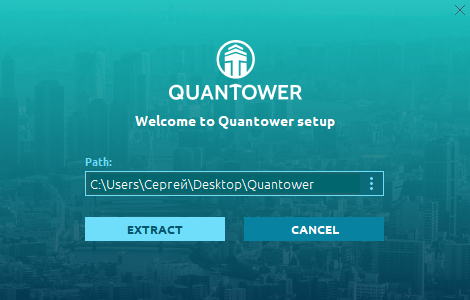

# Installation

## About installation

Once you downloaded Quantower application from Quantower official website — you are ready to start an installation process. From this point we must clarify the main differences between Quantower "installation process" and default Windows® install process, that most users are accustomed to.


Quantower does not copy it's files to the system folders \(AppData or Program Files\) of the OS, nor does write changes to the system registry


What does it mean? The program doesn't violate the integrity of the OS, and in case of removal, it will not leave any prints of its presence on your computer. Quantower’s "installer" literally extracts files to the user-specified folder.

This approach allows you to store \(and launch\) the Quantower on removable drive for use on any other computer as the portable application. It can be convenient when you need to move Quantower with all of its settings to another PC; just copy Quantower folder and paste where you need.

## Installation steps

1. [Download the app installer](https://updates.quantower.com/Quantower/x64/latest/stable/Quantower.exe) and launch the _**Quantower.exe**_ file
2. Select the folder to extract application files
3. Once an extraction process being finished the platform will start automatically with Emulator connection enabled and the default workspace


Please note, that you may need to allow an in-going and outgoing connection for _**Starter.exe**_ file \(the main executable of Quantower terminal\) in your Firewall settings


From this moment you can start trading and analysis as well as workspace modification

## Uninstall

If you need to uninstall the application, just delete the folder with all application files. You may also keep your personal settings \(connection information & workspaces\) by copying the Settings folder \(can be found right in Quantower folder\) before application delete. These Settings folder can be pasted to any other Quantower folder later.

