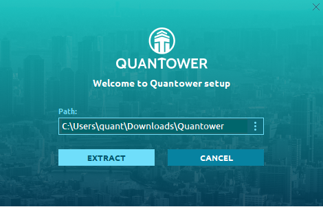

# Installation

* [**System Requirements**](installation.md#pc-requirements)\*\*\*\*
* \*\*\*\*[**Installation Steps**](installation.md#installation-steps)\*\*\*\*
* \*\*\*\*[**Uninstallation**](installation.md#uninstall)\*\*\*\*

Once you downloaded Quantower application from Quantower official website — you are ready to start an installation process. From this point we must clarify the main differences between Quantower "installation process" and default Windows® install process, that most users are accustomed to.




Quantower does not copy its files to the system folders \(AppData or Program Files\) of the OS, nor does write changes to the system registry


What does it mean? The program doesn't violate the integrity of the OS, and in case of removal, it will not leave any prints of its presence on your computer. Quantower’s "installer" literally extracts files to the user-specified folder.

This approach allows you to store \(and launch\) the Quantower on removable drive for use on any other computer as the portable application. It can be convenient when you need to move Quantower with all of its settings to another PC; just copy Quantower folder and paste where you need.

### PC requirements


* Windows 10
* .NET Framework v.4.8
* Available disk space — 1 GB \(depends on the volume of loaded history\)
* **The hardware requirements for Quantower depends upon what you are doing with it.** Most desktop systems can run Quantower without any difficulty. 
* The following hardware specifications, are very much recommended for a fast system: 16 GB RAM, minimum of 4 core CPU, and a SSD \(solid-state drive\).



**Microsoft has officially stopped supporting Windows 8 and Windows 7**. Therefore, the platform may not start or may work incorrectly. [More information on supported versions, please check on official Microsoft website.](https://support.microsoft.com/en-us/help/13853/windows-lifecycle-fact-sheet)  
  
We recommend using Windows 10.


### Installation steps

1. [**Download the app installer**](https://updates.quantower.com/Quantower/x64/latest/Quantower.exe) and launch the _**Quantower.exe**_ file
2. Select the folder to extract application files
3. Once an extraction process being finished the platform will start automatically with **Binance connection** in Info Mode and with the default workspace


Please note, that you may need to allow an in-going and outgoing connection for _**Starter.exe**_ file \(the main executable of Quantower terminal\) in your Firewall settings


### Uninstall

If you need to uninstall the application, just _**delete the folder with all application files**_. You may also keep your personal settings \(connection information & workspaces\) by copying the Settings folder \(can be found right in Quantower folder\) before application delete. These Settings folder can be pasted to any other Quantower folder later.

You may also refer to [**Backup & Restore manager**](backup-and-restore-manager.md) to backup your settings in one file and restore them later.

