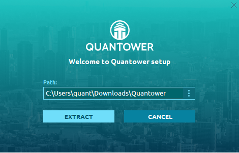

# Installation

* [**System Requirements**](installation.md#pc-requirements)
* [**Installation Steps**](installation.md#installation-steps)
* [**Uninstalling**](installation.md#uninstall)

***

Once you've downloaded the [**Quantower platform**](https://www.quantower.com/download) from our official website, you're ready to install it. Quantower installs differently from the standard Windows® setup most users are used to — here's what that means.




Quantower doesn't copy files into your system folders (AppData or Program Files), and it doesn't write anything to the Windows registry.


In practice, this means Quantower never touches the rest of your operating system, and when you remove it, it leaves no traces behind. The "installer" simply extracts the program files into a folder you choose.

Because of this, you can keep Quantower on a removable drive and run it as a portable app on any computer. It also makes moving Quantower — along with all your settings — to another PC effortless: just copy the Quantower folder and paste it wherever you like.

### System requirements


* Windows 10 or 11
* [.NET 8.](https://dotnet.microsoft.com/en-us/download/dotnet/thank-you/runtime-desktop-8.0.15-windows-x64-installer) In most cases, the platform will prompt you to update .NET to the latest version from Microsoft's official website.
* At least 1 GB of free disk space (more if you load a lot of market history).
* **Hardware requirements depend on how you use Quantower.** Most desktop systems run it without any trouble.
* For a fast, responsive setup, we recommend 16 GB of RAM, a 4-core CPU or better, and an SSD (solid-state drive).



**Microsoft no longer supports Windows 7 or Windows 8**, so the platform may fail to start or behave incorrectly on them. [See Microsoft's official site for details on supported versions.](https://support.microsoft.com/en-us/help/13853/windows-lifecycle-fact-sheet)\
\
We recommend Windows 10 or 11.


### Installation steps

1. [**Download the installer**](https://updates.quantower.com/Quantower/x64/latest/Quantower.exe) and run the _**Quantower.exe**_ file.
2. Choose a folder to extract the application files into — ideally your Downloads folder or a secondary drive, not the system drive. Some features may not work correctly if you install Quantower on the C: system drive because of Windows administrative rules and restrictions.
3. When extraction finishes, the platform starts automatically. A window opens where you can pick the connection to enable by default, along with the default [**workspace**](https://help.quantower.com/quantower/general-settings/workspaces-binds-groups).

***

<mark style="background-color:blue;">**dxFeed Simulated**</mark> provides market data for a limited set of symbols with a 24-hour delay. This connection is meant only for getting to know the platform.


To get **real-time data** or access more symbols from dxFeed, [**subscribe to their paid service**](https://get.dxfeed.com/orders/new/quantower) on their official website.


If you choose <mark style="background-color:blue;">**Binance**</mark>, the platform connects in **Info mode**, without the ability to place trades. This connection is for exploring the platform or for viewing and analyzing real-time cryptocurrency charts.


To trade on Binance, switch to Trading mode and add your API keys. Learn more about [**connecting to the Binance exchange**](https://help.quantower.com/quantower/connections/connection-to-binance-futures).


<figure><figcaption></figcaption></figure>

Within a minute, a window appears with the platform's terms of use. Review and accept them to continue.

<figure><figcaption></figcaption></figure>


You may need to allow incoming and outgoing connections for the _**Starter.exe**_ file (Quantower's main executable) in your firewall settings.


<figure><figcaption>
Default workspace with DxFeed Simulated data
</figcaption></figure>

<figure><figcaption>
Default workspace with Binance Spot connection
</figcaption></figure>

### Uninstalling

To uninstall Quantower, simply _**delete the folder with the application files**_. If you want to keep your personal settings (connection details and workspaces), copy the "Settings" folder — located inside the Quantower folder — before deleting everything. You can later paste this "Settings" folder into any other Quantower folder.

You can also use the [**Backup & restore manager**](https://help.quantower.com/quantower/troubleshooting/backup-and-restore-manager) to save your settings to a single file and restore them later.
