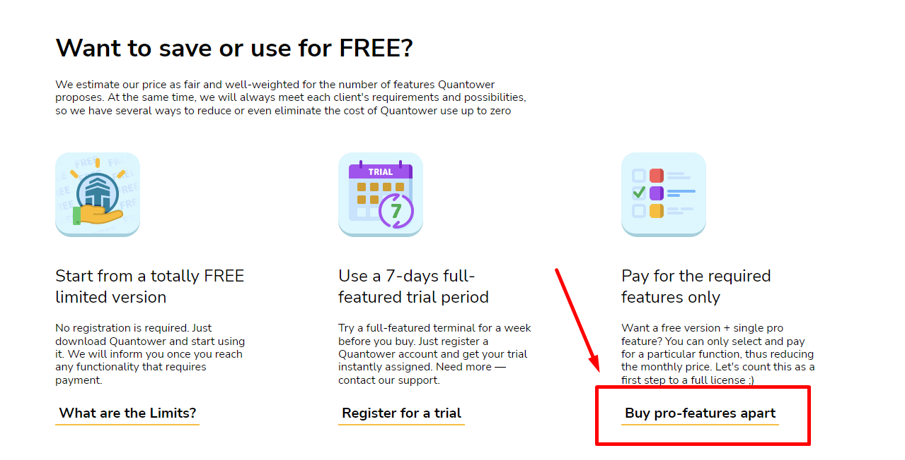

# Quantower Licenses

We deliver the most popular trading and analytics functionality for free, but some valuable and market-specific features are available under the paid License.


In case of any problems with your Quantower Account or License purchase — please [contact our Support team](https://www.quantower.com/contact-us)


To use any paid License, the trader needs to have an active [Quantower Account](quantower-account.md). If you don’t have one, you can create it during your License purchase process.



## All-in-one license

We have two great options to suit your trading needs. Our completely **free version** gives you access to all the fundamental trading tools you need, while our **all-in-one license** provides you with all the advanced features you need to take your trading to the next level. Choose the option that suits you best, and start trading with confidence today!&#x20;

Our **All-in-one license** is equipped with all the necessary tools for professional analysis and trading in various markets, including cryptocurrency, Forex, Futures, and Stocks brokers, among others.&#x20;

* The package includes connectivity to all major exchanges, brokers, and data feeds, allowing you to access multiple vendors simultaneously.
* [**Volume analysis tools**](https://www.quantower.com/volumeanalysistools), including the Cluster chart, Volume Profile, Time Statistics, Time Histogram, and VWAP, enable you to analyze trading volumes effectively.
* [**Advanced features**](https://www.quantower.com/advancedfeatures), such as Renko, Kagi, P\&F, and Heikin-Ashi chart types, Unlimited Overlays, Unlimited Indicators, Trading Simulator, Chart and Indicator Alerts, offer you even more trading flexibility.
* [**DOM Surface**](https://www.quantower.com/blog/dom-surface-panel-for-deep-order-flow-analysis) panel provides full access to the market depth of your instrument, giving you an edge in executing trades.
* [**Power Trades Scanner**](https://help.quantower.com/analytics-panels/chart/power-trades) that shows the execution of large orders in a short time. Please note that all accumulated by this panel data disappears after 3 minutes in the free version.
* [**Options Trading**](https://www.quantower.com/options-trading-features) license activates Options Analytics panel. Currently it's available for free usage.
* Moreover, with an active subscription, you'll automatically receive all new features as they become available.

## Free usage

### Just a Free version

There are three ways of using the Quantower totally FREE. The easiest one is to download the application and start using it. In this case, you will get a limited version but still allow trading and data analysis. In general, limitations are:

* Two indicators per chart
* One symbol overlay per chart
* one active connection to any broker, data feed, or exchange


Refer to the detailed table to learn more about [comparing the licenses](license-comparison.md).


### 7-day Trial period

To access all the features of the All-in-one version of Quantower, you can take advantage of the 7-day trial period. To do this, you must [register for a free Quantower account](quantower-account.md) and log in via the application. Once you confirm your account via email, the trial period will be automatically granted.

### Free version + one pro feature

If you want to purchase specific pro features instead of paying for the entire package, you can download and register for a Quantower account. Afterward, you can select and purchase the desired feature by clicking on the "Buy pro-features apart" link on the pricing page. This way, you can use the free version of Quantower along with the particular pro feature you require.

<figure><figcaption>
The way to customize your pro-features set for Quantower
</figcaption></figure>

## License purchase

If you would like to upgrade your Free license, go to our [Pricing page](https://www.quantower.com/pricing), choose the necessary license, it's period and click on the **BUY** button.

The purchase process starts with the authorization in the Quantower service. Use your email and password to Sign in to the account. If you don’t have one yet, follow the instructions on [Quantower Account manual](quantower-account.md). Just after you successfully Log in, you will be redirected to the purchase Cart.

Purchase cart contains the previously selected License type, term of validity and final Price. You can modify the term of validity to any desired option.

The next step is to select a payment provider and press the **Pay** button.


Also, you can make payments in cryptocurrencies or use direct bank transfers. To do it contact our support team.


After that, you will be redirected to the provider’s payment page. Once you complete all the payment steps, you will be redirected back to the confirmation page of Quantower Accounts. Follow the **GO TO DASHBOARD** link to get to your Quantower Account dashboard, where you should see you current Core License information and Payment transactions history.

## License terms

Currently, all licenses can be purchased for a 1-month term minimum. You can also get any Quantower paid License for the LIFETIME period — [contact our support](https://www.quantower.com/contact-us) for this.

## Quick tips on License purchase

* A free License is valid ALL THE TIME while your Quantower Account is active.
* Any paid License is active from the purchase date till the end date (“Available till”).
* Once your paid License is expired, the Account will be automatically downgraded to the Free License.
* Every new purchase for the similar license type extends the “Available till” date on the purchasing term.
* Subscription and automatic payments are currently unavailable.
