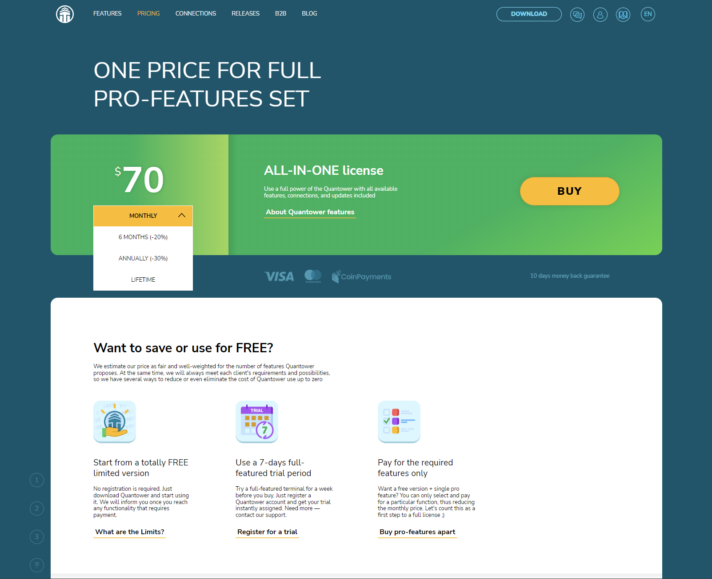
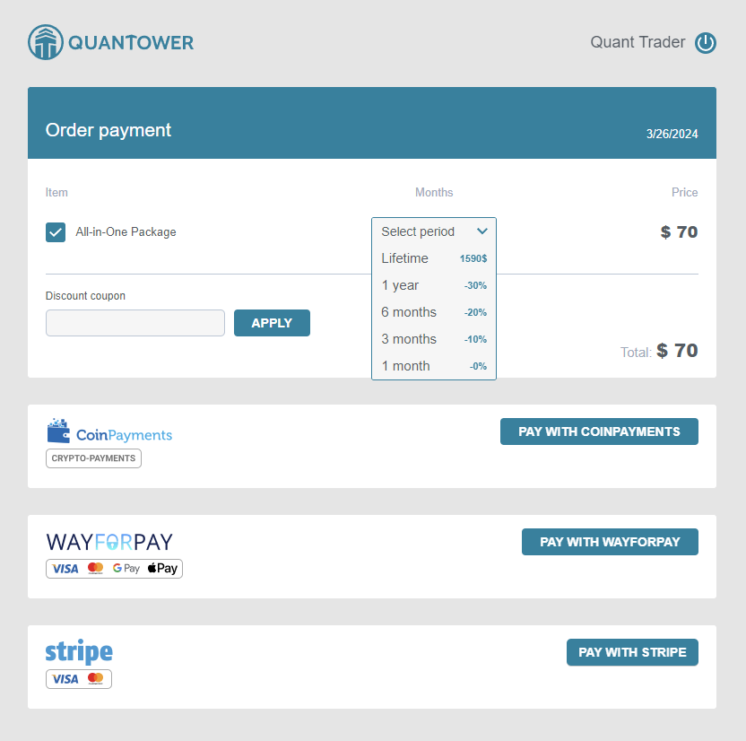

# Quantower Licenses

We deliver the most popular trading and analytics functionality for free, but some valuable and market-specific features are available under the paid License.


If you have any questions regarding your Quantower Account or License purchase, please [contact our Support team](https://www.quantower.com/contact-us).


To use any paid License, the trader needs to have an active [Quantower Account](quantower-account.md). If you don’t have one, you can create it during your License purchase process.



## All-in-one license

We offer two great choices for your trading requirements. Our **free version** includes all the basic tools you need, while our **all-in-one license** comes with advanced features for improved trading. Pick the one that suits you best and start trading with confidence today!

Our **All-in-one license** is equipped with all the necessary tools for professional analysis and trading in various markets, including cryptocurrency, Forex, Futures, and Stocks brokers, among others.&#x20;

* The package includes connectivity to all major exchanges, brokers, and data feeds, allowing you to access multiple vendors simultaneously.
* [**Volume analysis tools**](https://www.quantower.com/volumeanalysistools), including the Cluster chart, Volume Profile, Time Statistics, Time Histogram, and VWAP, enable you to analyze trading volumes effectively.
* [**Advanced features**](https://www.quantower.com/advancedfeatures), such as Renko, Kagi, P\&F, and Heikin-Ashi chart types, Unlimited Overlays, Unlimited Indicators, Trading Simulator, Chart and Indicator Alerts, offer you even more trading flexibility.
* [**DOM Surface**](https://www.quantower.com/blog/dom-surface-panel-for-deep-order-flow-analysis) panel provides full access to the market depth of your instrument, giving you an edge in executing trades.
* [**Power Trades Scanner**](https://help.quantower.com/analytics-panels/chart/power-trades) that shows the execution of large orders in a short time. Please note that all accumulated by this panel data disappears after 3 minutes in the free version.
* [**Options Trading**](https://www.quantower.com/options-trading-features) license activates Options Analytics panel. Currently it's available for free usage.
* Moreover, with an active subscription, you'll automatically receive all new features as they become available.

## Free usage

### Free Edition (without registration)

There are three ways of using the Quantower totally FREE. The easiest one is to download the application and start using it. In this case, you will get a limited version but still allow trading and data analysis. In general, limitations are:

* Two indicators per chart
* One symbol overlay per chart
* One active connection to any broker, data feed, or exchange


Refer to the detailed table to learn more about [comparing the licenses](license-comparison.md).


Quantower can be operated indefinitely in this specific mode, allowing users to leverage its features without any time constraints.

### 7-day full-featured Trial period

To access all the features of the All-in-one version of Quantower, you can take advantage of the 7-day trial period. To do this, you must [register for a free Quantower account](quantower-account.md) and log in via the application. Once you confirm your account via email, the trial period will be automatically granted.

### Free version + one pro feature

If you want to purchase specific pro features instead of paying for the entire package, you can download and register for a Quantower account. Afterward, you can select and purchase the desired feature by clicking on the "Buy pro-features apart" link on the pricing page. This way, you can use the free version of Quantower along with the particular pro feature you require.

<figure><figcaption>
The way to customize your pro-features set for Quantower
</figcaption></figure>

## License terms

You can purchase a license for as little as one month or a longer term of three months, six months, one year, or even a lifetime. This allows you to select the duration best suited to your requirements. The one-month license is ideal as a trial, while the longer-term licenses are perfect for ongoing access.&#x20;

### Lifetime term

A lifetime term gives you access to an All-in-one license or a particular feature license for the duration of the Quantower terminal's existence, including all future updates and functionalities covered by the license.

With a lifetime license, you can enjoy uninterrupted access to our Quantower without worrying about renewals or additional payments.

## How to Purchase a License on Quantower

#### Selecting a License

1. **Navigate to the** [**Pricing page**](https://www.quantower.com/pricing)**.** Here, you can upgrade your Free license.
2. **Choose your preferred license and its duration.** Click the **BUY** button to proceed.

#### Logging In

3. **Log into the Quantower service.** Use your email and password for authorization. If you're a new user, follow the onsite [instructions to create an account](quantower-account.md#account-creation).

#### Finalizing Your Purchase

4. **Review your purchase cart.** It will display your selected license type, term of validity, and total price. You can adjust the term of validity at this point if you wish.
5. **Select a payment provider.** Click the **Pay** button corresponding to your chosen provider to complete the payment process.

After successfully logging in and making your selection, you will be redirected to the purchase cart to finalize your purchase.


You can make payments through direct bank transfers. Please [contact our support team](https://www.quantower.com/contact-us) for further details.


After completing the payment on the provider's page, you will be redirected back to the Quantower Accounts confirmation page. To access your Quantower Account dashboard, click on the **GO TO DASHBOARD** link. Here, you'll find your Core License details and a history of your payment transactions.

## Quick tips on License purchase

* Your Quantower Account comes with a free license that remains valid as long as your account is active.
* Any paid license remains active from the purchase date until the end date, also known as the "Available till" date.
* After the paid license expires, the account will be automatically downgraded to the free license level.
* Every additional purchase of a similar license type extends the "Available till" date of the existing license.
* Currently, it is impossible to subscribe or make automatic payments.
