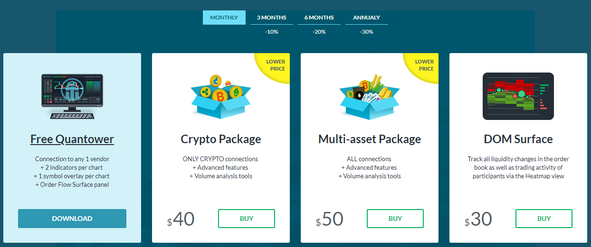

# Quantower Licenses

We deliver the most popular trading and analytics functionality for free, but some valuable and market-specific features are available under the paid License.


In case of any problems with your Quantower Account or License purchase — please [contact our Support team](https://www.quantower.com/contact-us)


To use any paid License, the trader needs to have an active [Quantower Account](quantower-account.md). If you don’t have one, you can create it during your License purchase process.



## License types

We offer a user with a Free license, two packages as well as licenses for separate features. 

**Free license** is granted by default once you have created a Quantower Account. Also, it will be available all the time when you don’t have any active paid License. Using Free license, you can freely connect to and trade with any available vendor as well as use the most panels and functions of the platform.

**Crypto Package** contains the necessary functionality for professional analysis and trading in the cryptocurrency market. For this package are available: 

* all connected crypto exchanges, 
* simultaneous connection to several exchanges, 
* [volume analysis tools](https://www.quantower.com/volumeanalysistools) — Cluster chart, Volume Profile, Time Statistics, Time Histogram, VWAP
* Order Flow Surface panel
* [advanced features](https://www.quantower.com/advancedfeatures) — Renko, Kagi, P&F and Heikin-Ashi chart types, Unlimited Overlays, Unlimited Indicators, Trading Simulator, Chart and Indicator Alerts

Multi-asset Package

DOM Surface license

Power Trades Scanner license

Volume Analysis license

\*\*\*\*[**Advanced Features**](https://www.quantower.com/advancedfeatures) license includes non-standard chart types, simultanious connections, additional functionalities for working with symbol’s history, unlimited chart overlays, and trading simulation.

Options Trading license


Check the [Licenses comparison table](https://www.quantower.com/pricing) on the Quantower website.


## License purchase

If you would like to upgrade your Free license, go to our [Pricing page](https://www.quantower.com/pricing) and click on the **BUY BASIC** or **BUY PREMIUM** button.

The purchase process starts with the authorization in the Quantower service. Use your email and password to Sign in to the account. If you don’t have one yet, follow the instructions on [Quantower Account manual](quantower-account.md). Just after you successfully Log in, you will be redirected to the purchase Cart.

Purchase cart contains the previously selected License type, term of validity and final Price. You can modify the term of validity to any desired option.

The next step is to select a payment provider and press the **Pay** button.


Also, you can make payments in cryptocurrencies or use direct bank transfers. To do it contact our support team.


After that, you will be redirected to the provider’s payment page. Once you complete all the payment steps, you will be redirected back to the confirmation page of Quantower Accounts. Follow the **GO TO DASHBOARD** link to get to your Quantower Account dashboard, where you should see you current Core License information and Payment transactions history.

## License terms

Currently, all licenses can be purchased for a 1-month term minimum. You can also get any Quantower paid License for the LIFETIME period — [contact our support](https://www.quantower.com/contact-us) for this.

## Quick tips on License purchase

* A free License is valid ALL THE TIME while your Quantower Account is active.
* Any paid License is active from the purchase date till the end date \(“Available till”\).
* Once your paid License is expired, the Account will be automatically downgraded to the Free License.
* Every new purchase for the similar license type extends the “Available till” date on the purchasing term.
* Subscription and automatic payments are currently unavailable.

