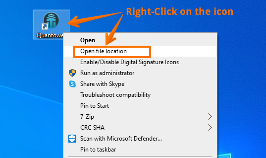
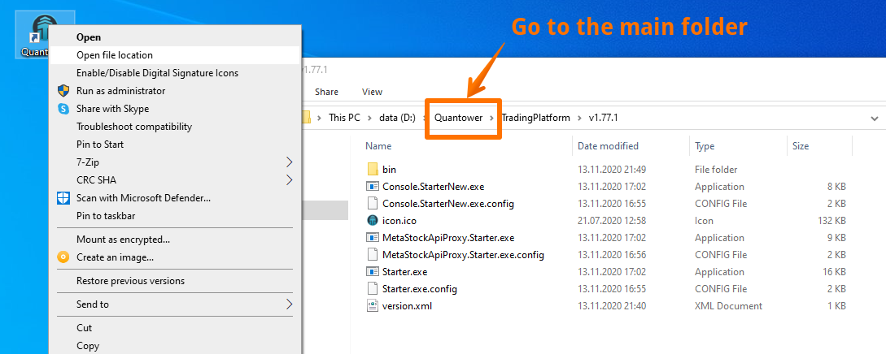
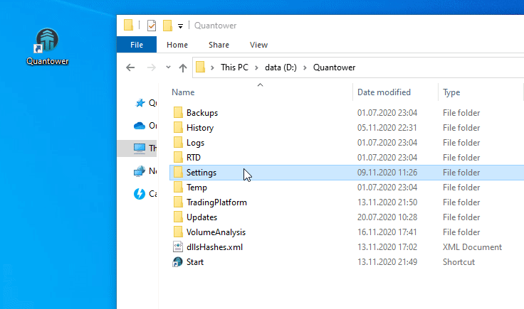

# Reset settings to default

Settings folder contains all the workspaces, saved templates, as well as all the visual changes that have been applied to panels, indicators, drawing tools. Below we will consider the basic operations that you can perform with the settings folder for comfortable work with the platform.

* \*\*\*\*[**How to Reset All Settings to default**](reset-settings-to-default.md#how-to-reset-all-settings-to-default)\*\*\*\*
* How to Reset Settings of a particular panel, drawing, indicator
* How to share your Templates, Workspaces with other traders
* How to copy settings to other PC



### How to Reset All Settings to default

Sometimes all platform's settings need to be reset to default. To do this, close the platform, **Right-click** on Quantower icon and select **Open File Location** from the context menu.


You can save the current settings if you want to return to them later. Just rename your **Settings** folder to something else, like _**Settings\_My**_ etc.


A folder with the main files of the latest \(installed\) version of the program will open.   
_**Go to the main folder of the platform.**_

_Rename the **Settings** folder_ \(for example, Settings1 or Settings\_old\). After you rename the folder, run the platform. The new Settings folder will automatically appear with default settings.


Before sending your Settings to developers for checking the problem, add the full settings folder to the ZIP or RAR archive and send it to **info@quantower.com** with a brief description of your problem


