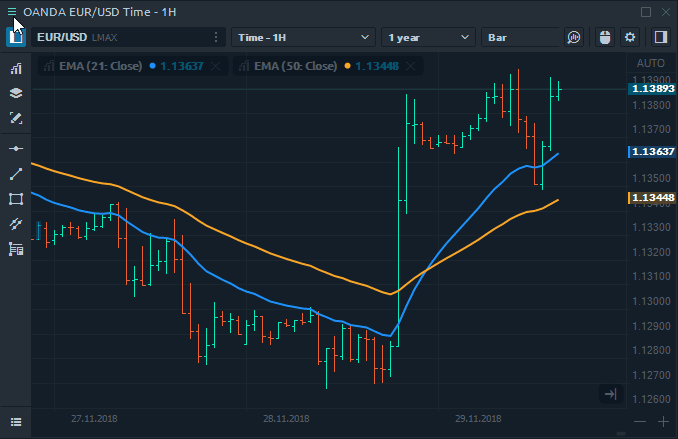

# Set as Default

Flexible platform settings allow you to customize any panel on your own. Change the font, color, add indicators, determine the displaying of the required columns in the table, etc.

But if you don’t want to configure the newly opened panels every time, we have created the "**Set as Default"** option that redefines the factory settings. 

### How it works?

The process of saving settings is pretty simple:

* **Open the panel** for which you want to assign new settings.
* **Customize the panel**. For example, on the chart panel, add any indicator, change the font size of the price axis, change the background color.
* Click on the panel's context menu \(left upper corner\) and click on the **Set as Default**. You will see the message "_**Settings saved as default layout**_".
* A new panel will open with saved settings.

