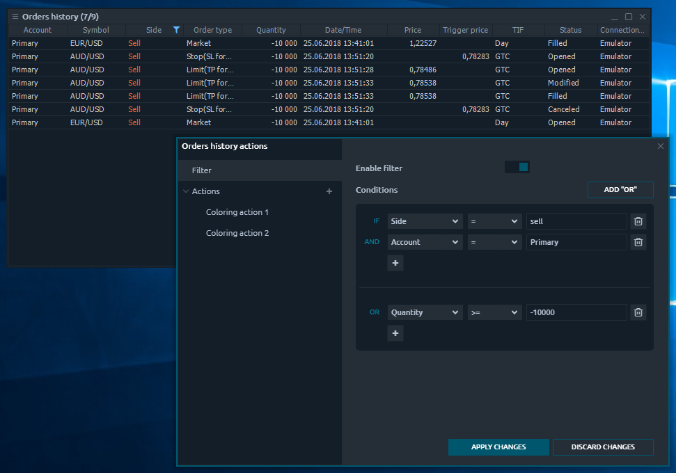
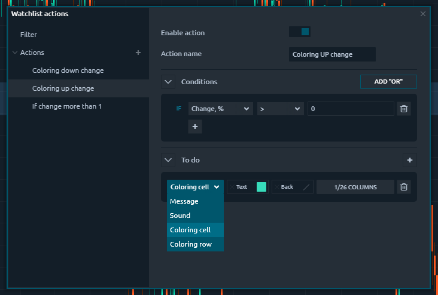

# Table management

## Table panels

Table panels are represented as a separate class — they all have at least 99% of functionality based on the table view. We use the common table component for all of these panels, so the behavior and features are mostly the same.

Some table panels have a special toolbar that can be used for Mass-filtering or Quick actions. Other table panels can have no column headers because they don’t really need for understanding the data, thus were hidden to save space; this disables an ability to filter columns data in such panels.

## Columns management

Data in table panels are organized in rows and columns, where each item’s \(row\) parameters are displayed in columns. Not all of the available columns are displayed by default in each table panel. We have selected the most popular and vital per panel and made an ability to modify the columns set as you like.

Right-click on any column header to see the “_**Column set**_” context menu. Then click on any item in this menu to switch the column’s visibility. You can disable up to 1 column minimum; the last visible column won’t be available to hide. 

Other useful features of columns management are sorting and resize. Each column can be dragged by its header between other columns inside the table in order to set the required sequence. You can also drag the vertical borders between two columns to resize them.

## Filtering

The set of rows in the table can be filtered by some data value in their column. There are two ways to apply the filtering: 

* Quick table filter
* Advanced table filter


Quick table filter is just another point of access to advanced filtering option, allowing to apply simple filters in several clicks.


Quick table filter can be accessed by clicking the “_**Filter**_” icon in any table column’s header.

Depending on the data type in a column, the Quick filter will give you the corresponding form for input; currently “_**String**_”, “_**Date/time**_” & “_**Number**_” filtering are supported. Once you select some option — the table rows will be filtered to that ones, containing the selected value. Quick filter can be cancelled by pressing “_**Cancel filtering**_” option.

### Advanced table filter

In case you would like to apply some more complex filtering \(multi-filtering\) you can open an advanced filter from panel’s context menu, option “_**Setup actions**_”. This screen has two tabs on the left side, where the first one is an Advanced filter.


You will see your filters here if you have applied some previously in Quick mode.


This screen allows you to Enable/disable filtering as well as set up filtering Conditions. These conditions are set up as:

$$
IF (condition1 AND condition2 ...) OR (conditionN...) …
$$

You can setup as many conditions as you like. Due to the possible complex logic of filtering, you are required to apply the changes once you finished the filter set up.


Please notice, not all of applied via Advanced filter conditions can be accessed from the Quick filter.


## Sorting

Each table can be sorted by column value. To sort the table, click on column’s header; you will see a “_**Sorting**_” icon appears. The next click on this header will revert the sorting by this column. You can sort your table only by one column simultaneously.

## Grouping

If you want to organize your rows more precisely, you can use a “_**Rows grouping**_” feature. It allows separating all table items in groups, made from data of some column. Currently, only “_**String**_” data columns are supported for grouping.

To apply the grouping just right-click on table body and find an option “_**Group by**_”; the second-level of context menu will contain all of available columns that can be grouped by. You can group by one column only. To cancel grouping — follow the previous steps and uncheck the column.

## Table actions

This feature allows you to setup certain behavior on some data change in the table. Currently, Quantower tables support four types of actions:

* Show message
* Play sound
* Color row
* Color cell

The Table actions functionality can be found under the panel’s context menu option “Setup Actions” and once launched, it opens an “Actions screen”, where you can manage your Actions. The process of Action creation is not complicated.

1. Create an Action item 
2. Set conditions \(“OR” & “AND”\) 
3. Set tasks \(Show message, Play sound, Color row, Color cell\) 
4. Save Action 
5. Enable Action

### Table actions conditions

Conditions setup for Table Actions is similar to [Filtering conditions, mentioned earlier](table-management.md#advanced-table-filter).

### Table actions tasks

Once some condition is met, action will execute the corresponding tasks. Each task will be executed as many times, as the condition was met.

| **Show message** | Displays a popup box with the user-specified message |
| :--- | :--- |
| **Play sound** | Plays some user selected sound file |
| **Color row** | Changes the styling of the whole row, where the condition was met. Allows changing the background and/or text colors. |
| **Color cell** | Changes the styling of the specified cell\(s\) of the row, where the condition was met. Allows changing the background and/or text colors. |


Be careful with the frequently occurring conditions. Some may be met several times per second, so tasks like “_Play sound_” can become disturbing. The “_Show message_” task, fired several times, will be shown as one message box.


