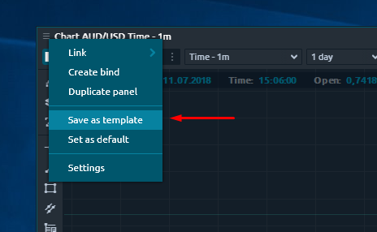
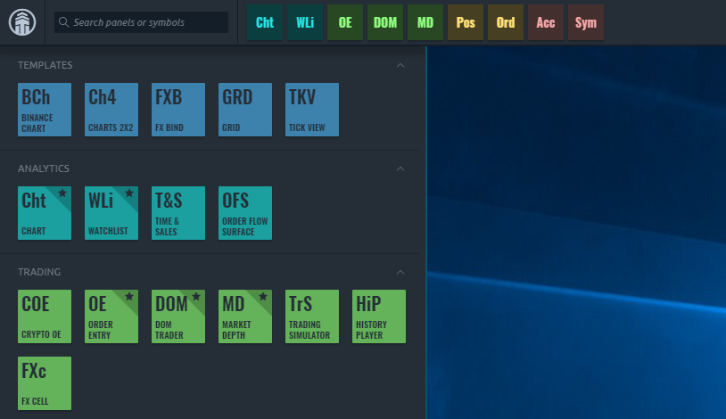

# Templates

## General purpose

Due to the wide list of features, most panels in Quantower terminal have a huge list of customization possibilities. The more powerful panel is — more settings it has. This allows any user to tune each functionality by its own and sometimes this process can take a lot of time to complete.

In order to save your work on workspace customization, we have developed a _**“Templates”**_ functionality. It helps you to save your customizations in special objects — templates — and instantiate them later, keeping all of the applied settings.

You can save any Panel, Group or Bind as a template, so its usefulness is very promising.

## Creating template

The process of Template creation is as simple as 1-2-3: 

1. Launch any panel \(group or bind\)
2. Customize it
3. Save as Template

All of the created templates are stored in Control center sidebar, under the _**“Templates”**_ group. So you can launch any template from this place any time you wish. You can put the saved templates on the Favorites bar of Control center, as any other default panel.

If you want to **edit** the template name or **delete** it from your terminal — use the context menu on it. Each Template stores all of the settings data, including sizes, coloring, internal elements visibility, a predefined symbol of account values, additional specific settings etc. In other words: all that you can customize + more.


You can **share your templates** with other Quantower traders by sharing the template files with them. Template files can be found in “Quantower -&gt; Settings -&gt; Templates” folder.


