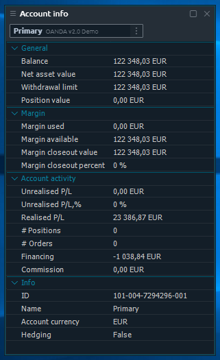

# Account info

The purpose of this panel is to show all of the available account information to user. Account info panel is required to have at least one active connection with trading account to show data about.

The set of parameters diversify depending on particular account \(Connection\) and represents the total list of all provided by the vendor data.


You can hide the toolbar containing "Account lookup" field \(via Settings\) in case you have only one connection in order to save some space.


