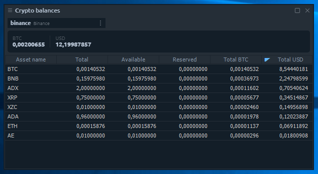

# Crypto balances


This panel refers to the Crypto-specific panels, meaning that it can be used when the user has at least one active connection with crypto symbols.


Crypto balances panel shows all of your coin balances list. Here you can find info about the amounts per asset: total, available for trading, reserved in opened orders, calculated in BTC, calculated in USD.

There is also an info bar with total amounts of your coins in BTC & USD. By default, we hid assets with zero balances, so the list looks more clear, but you can enable the full list via the panel settings \(“Hide zero balances” option\).

