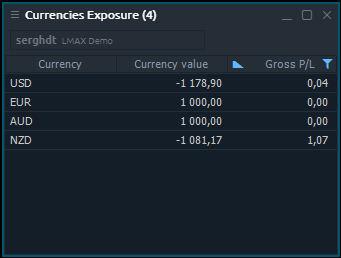
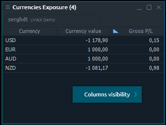

# Currencies Exposure

Currencies Exposure panel shows a summary currency information for all positions, opened on Forex instruments. Currencies Exposure panel is related to Informational group of Control Center sidebar.

## Available columns

| **Currency** | Name of the currency |
| :--- | :--- |
| **Currency value** | Summary total amount of currency for all opened positions |
| **Gross P/L** | Current profit or loss for all opened positions |

## Context menu actions

By right-clicking on each row of Currencies Exposure panel, you will get a context menu with the following functions:

