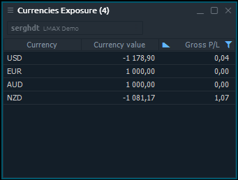
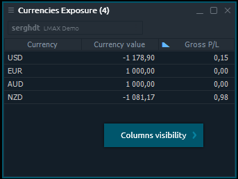

# Currencies Exposure

Currencies Exposure panel shows a summary of currency information for all positions opened on Forex instruments. Currencies Exposure panel is related to the Informational group of the Control Center sidebar.

## Available columns

| **Currency**       | Name of the currency                                      |
| ------------------ | --------------------------------------------------------- |
| **Currency value** | Summary total amount of currency for all opened positions |
| **Gross P/L**      | Current profit or loss for all opened positions           |

## Context menu actions

By right-clicking on each row of the Currencies Exposure panel, you will get a context menu with the following functions:

