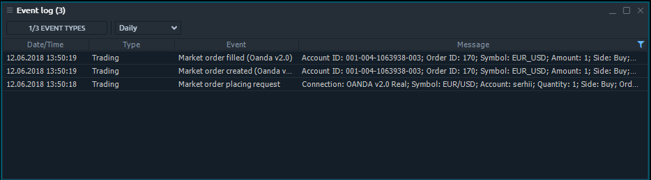

# Event Log

Event Log panel displays detail information about all events that occured during working with trading platform. Event Log panel is related to Informational group of Control Center sidebar.

## Available columns

| **Date/Time** | Date and time when a event was occured |
| --- | --- | --- | --- | --- | --- | --- | --- | --- | --- | --- | --- | --- | --- | --- | --- | --- | --- | --- | --- | --- | --- | --- |
| **Type** | Type of event. Can be: Trading, System or Exception |
| **Event** | Short name of event |
| **Message** | Full details of event |
| **Connection name** |  |

## Context menu actions

By right-clicking on each row of Event Log panel, you will get a context menu with the following functions:

### Common actions

| **Clear table** | Remove all rows from Event Log panel. |
| --- | --- |
| **Columns visibility** | Allows to toggle the columns visibility |

