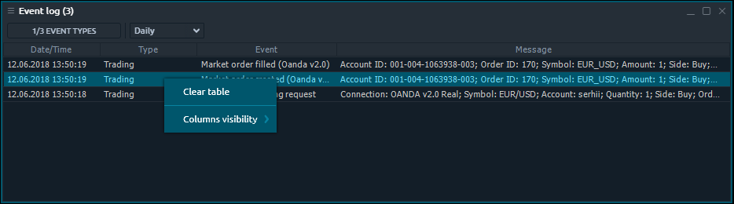

# Event Log

Event Log panel displays detail information about all events that occurred during working with the trading platform. Event Log panel is related to Informational group of Control Center sidebar. if any error occurs, it will be logged here. You can see such important information about the platform here and pass it on to our technical support if necessary.

## Available columns

| **Date/Time** | Date and time when a event was occured |
| :--- | :--- |
| **Type** | Type of event. Can be: Trading, System or Exception |
| **Event** | Short name of event |
| **Message** | Full details of event |
| **Connection name** | The name of connection, that event is related to |

## Context menu actions

By right-clicking on each row of Event Log panel, you will get a context menu with the following functions:

### Common actions

| **Clear table** | Remove all rows from Event Log panel. |
| :--- | :--- |
| **Columns visibility** | Allows to toggle the columns visibility |


"Clear table" action removes only data from current table, but not files from your drive. All history logs are still available - you can refill table via "Range selector" on panel tool bar. 


